 # NHỮNG VIỆC ĐƯỢC TRIỂN KHAI
1. **Tìm hiểu về các dịch vụ của nhà cung cấp Nhân Hòa**
2. **Các công cụ cần thiết:** 
   - ` `Cài đặt và tìm hiểu về các công cụ VMware, MobaXterm (putty), Vitual studio code, Draw.io.
   - Biết được lý do chọn telegram để sử dụng (bot telegram)
3. **Tìm hiểu và sử dụng Github:** Biết tạo file, chỉnh sửa, xóa và đồng bộ giữa github và vitual studio code
4. **Tìm hiểu và sử dụng markdown**

# ĐÃ HOÀN THÀNH

1. **Các dịch vụ của nhà cung cấp Nhân Hòa:**
   
   1.1 **Khái niệm**
- **Tên miền (Domain Name)** là **địa chỉ website** trên internet–giúp người dùng truy cập dễ dàng thay vì phải nhớ dãy số IP dài ngoằng.
- Tên miền phải được đăng ký. Khi tên miền được đăng ký, thông tin về trang web của bạn – bao gồm địa chỉ IP của web hosting mà bạn sử dụng sẽ được lưu trữ trên máy chủ DNS.
- **DNS** là viết tắt của Hệ thống tên miền. Máy chủ DNS chịu trách nhiệm thông báo cho tất cả các máy tính khác trên Internet về tên miền và địa chỉ trang web của bạn.

   1.2. **Cấu trúc tên miền**

- Tên miền thường có 3 phần (đọc từ **phải sang trái**):

  Ví dụ: [***www.nhanhoa.com***](http://www.nhanhoa.com)

  www.nhanhoa.com

  ` `│            │                 └─Tên miền cấp 1 (Top-Level Domain - TLD): **`.com**`

  ` `│            └─────Tên miền cấp 2 (Second-Level Domain): `**nhanhoa**`

  ` `└────────Subdomain: `**www**` (có thể thay bằng blog., mail., ...)

   1.3. **Nguyên lý đăng ký tên miền**

- Tên miền không được vượt quá 63 ký tự, bao gồm cả phần .com, .net, .org ...
- Tên miền chỉ gồm các ký tự trong bảng chữ cái (a-z), các số (0-9) và dấu trừ (-).
- Các khoảng trắng và các ký tự đặc biệt trong tên miền khác đều không hợp lệ.
- Không thể bắt đầu bằng hoặc kết thúc tên miền bằng dấu trừ (-).
- Tên miền càng ngắn càng tốt, dễ nhớ, không gây nhầm lẫn, khó viết sai.
- Tên miền phải liên quan đến tên chủ thể và lĩnh vực hoạt động.
- Chủ động nộp phí duy trì trước khi tên miền hết thời hạn sử dụng, tự chịu trách nhiệm khi tên miền bị mất do hết hạn sử dụng mà không đóng phí.

   1.4. **Phân loại** 	

- Phân loại tên miền (domain) chia thành 2 nhóm

  + Tên miền cao cấp dùng chung

  + Tên miền quốc gia cao cấp nhất

2. **Hosting**
- "Hosting" là **nơi lưu trữ tất cả dữ liệu của website** (như hình ảnh, mã nguồn, cơ sở dữ liệu...); Là dịch vụ cho phép chúng ta **đưa website hoặc ứng dụng của mình lên Internet** để người khác có thể truy cập được.

  2.1. **Cách Web Hosting hoạt động**

- Web hosting = “máy chủ chứa toàn bộ nội dung web”
- Người dùng → nhập tên miền → hệ thống trỏ đến hosting → hiển thị web

  Để dễ hiểu hơn, giả sử bạn đang muốn tạo một Website, hãy ví cái website đó như một cửa hàng thì trước tiên khi mở cửa hàng bạn cần chọn cho mình một **Hosting** là mảnh đất nơi đặt cửa hàng. Trong đó **Tên miền (domain)** là địa chỉ để người khác tìm đến cửa hàng của bạn.

  **Website** là cửa hàng thực tế, gồm các sản phẩm (nội dung, hình ảnh, video...).

- Khi người dùng trình duyệt truy cập vào website của bạn (nhanhoa.com)à Trình duyệt sẽ hỏi DNS *nhanhoa.com* ở đâu à Hệ thống **DNS** trả về **địa chỉ IP** của máy chủ (hosting)à Trình duyệt gửi yêu cầu HTTP đến Hosting qua cổng 80 hoặc 443à Lúc này **Hosting (Web Server)** sẽ xử lý yêu cầu: dùng phần mềm như Apache, Nginx, LiteSpeed để chạy chạy file PHP, truy vấn MySQL, trả về nội dung HTML à Hiển thị giao diện web

   2.2. **Các dịch vụ Hosting mà Nhân Hòa cung cấp**

- ` `**NVMe Hosting**: Dùng ổ cứng NVMe (rất nhanh, mới nhất) - phù hợp Web cần tốc độ cao, load nặng, nhiều truy vấn
- ` `**Workpress Hosting**: Tối ưu sẵn cho WordPress (auto cài, cache, bảo mật...) – phù hợp với người dùng WordPress, không rành kỹ thuật
- ` `**Linux Hosting:** Chạy hệ điều hành Linux, hỗ trợ PHP, MySQL, WordPress...
- ` `**Windows Hosting:** Chạy hệ điều hành Windows, hỗ trợ ASP.NET, MSSQL...

3. **Cloud**
- **Cloud** (điện toán đám mây) là mô hình sử dụng **tài nguyên máy chủ (server, lưu trữ, mạng, phần mềm...)** thông qua Internet thay vì cài đặt trên máy vật lý cố định.
- Các dịch vụ Cloud Nhân Hòa cung cấp:

  + SSD Cloud VPS

  + SSD Cloud Server

  + NVMe Cloud VPS

  + Cloud Firewall 

  + Cloud Storage 

  + Cloud Backup

  + Cloud VPS Quốc tế/ Google cloud/Azure

4. **Máy chủ (Server)**
- **Máy chủ** là một máy tính chuyên dụng có nhiệm vụ **cung cấp tài nguyên, dịch vụ hoặc dữ liệu cho các thiết bị khác (gọi là "client")** qua mạng nội bộ hoặc Internet.
- **Phân loại** **máy chủ** (theo hình thức)

  **+** Máy chủ vật lý (Dedicated Server): Máy chủ thật, riêng biệt, không chia sẻ

  + Máy chủ ảo (VPS): Tạo từ máy chủ vật lý → chia thành nhiều VPS nhỏ

  + Máy chủ cloud: VPS chạy trên hệ thống cloud – mở rộng linh hoạt

5. **SSL**
- SSL (Secure Sockets Layer) là chứng chỉ bảo mật dùng để mã hóa dữ liệu truyền giữa trình duyệt và máy chủ, giúp bảo vệ thông tin người dùng khi truy cập website.

→ Website có SSL sẽ hiển thị https:// và biểu tượng ổ khóa trên trình duyệt.

- **Phân loại**:

|**PLoại SSL**|**Mô tả**|**Mức độ xác thực**|
| :-: | :-: | :-: |
|**DV (Domain Validation)**|Xác minh tên miền|Thấp (nhanh, phổ biến)|
|**OV (Organization Validation)**|Xác minh tên miền + tổ chức sở hữu|` `Trung bình|
|**EV (Extended Validation)**|Xác minh kỹ + hiển thị tên công ty|Cao nhất|

\+ Ngoài ra còn có các loại SSL mở rộng :

- **SANs SSL (Subject Alternative Names**): Bảo mật cho nhiều tên miền khác nhau
- **Wildcard SSL (Wildcard SSL Certificate):** Bảo mật cho** 1 tên miền chính + tất cả subdomain của nó

**\*Tại sao nên sử dụng SSL?***

Khi bạn đăng ký tên miền để sử dụng các dịch vụ website, email v.v… luôn có những lỗ hổng bảo mật cho hacker tấn công, SSL bảo vệ website và khách hàng của bạn.

\- An toàn dữ liệu: dữ liệu không bị thay đổi bởi hacker.

\- Bảo mật dữ liệu: dữ liệu được mã hóa và chỉ người nhận đích thực mới có thể giải mã.

\- Chống chối bỏ: đối tượng thực hiện gửi dữ liệu không thể phủ nhận dữ liệu của mình.

\- Tiêu chuẩn xác thực – SSL chỉ được cung cấp bởi các đơn vị cấp phát chứng thư (CA) có uy tín trên toàn thế giới sau khi đã thực hiện xác minh thông tin về chủ thể đăng ký rất kỹ càng mang lại mức độ tin cậy cao cho người dùng Internet và tạo nên giá trị cho các website, doanh nghiệp cung cấp dịch vụ.

\- Tăng chuyển đổi: Khách tin tưởng khi mua hàng

\- Chống giả mạo: Chứng minh website là chính chủ

1. **Umai** 
- UMail là dịch vụ email theo tên miền giúp doanh nghiệp có thể kết nối, tương tác với khách hàng/ đối tác một cách dễ dàng, nhanh chóng và chuyên nghiệp hơn.
- Với UMail, doanh nghiệp có ngay một hệ thống quản lý tập trung email nhân viên, đồng thời tăng cường khả năng bảo mật với các cơ chế chống virus/ spam hiện đại.

**\*\*Phân Loại\*\***

- UMail có 4 phân loại cho người dùng 
- Cá nhân
- Cơ bản
- Doanh nghiệp 
- Chuyên nghiệp 

**\*\*Tại sao nên sử dụng Umail?\*\***

- Khẳng định, nâng tầm thương hiệu doanh nghiệp:

  Khi sử dụng Umail, tên email của bạn sẽ trở nên chuyên nghiệp hơn và có dạng: xyz@tencongty.com.

- Quản lý tập trung email nhân viên
- Umail thay đổi cổng kết nối từ POP3/ IMAP sang SSL/ TLS để đảm bảo tính bảo mật ở mức cao nhất.
- Hệ thống quản trị thuận tiện, chuyên nghiệp: Với Umail, quản trị viên sẽ dễ dàng thao tác xóa, thêm, quản lý người dùng/ nhóm và có thể chủ động điều chỉnh dung lượng email trên mỗi tài khoản.
- Hoạt động ổn định: Nhằm đảm bảo quá trình sử dụng email luôn thông suốt, không bị gián đoạn, luôn có máy chủ định tuyến và dự phòng SMTP (giao thức đứng sau việc vận hành email) để gửi thư từ máy chủ này qua máy chủ khác.
- Gia tăng độ tin cậy cho địa chỉ mail:
- Nhờ chứng thực SPF/ DKIM xác định máy chủ mail được quyền gửi thư đại diện cho tên miền của doanh nghiệp, nội dung email sẽ được đánh giá cao hơn, đảm bảo đúng người gửi, không bị giả mạo, giảm tối đa email spam
- Không bị bỏ sót bất cứ thông tin quan trọng nào do email được cài đặt cấu hình Catch-All, bạn có thể nhận được toàn bộ mail được gửi ngay cả trong trường hợp người gửi ghi sai tên mail.
1. **Cài đặt và tìm hiểu các công cụ cần thiết:** 
   1. **VMware** 
- VMware Workstation được biết đến là một phần mềm ảo mà tại đây người dùng có thể tạo một máy ảo làm việc trên máy tính của bạn. Tuy nhiên, máy ảo này lại hoạt động độc lập, do đó đây sẽ là môi trường lý tưởng để người dùng có thể thử nghiệm một vài hệ điều hành mới như Linux hoặc truy cập những website có độ tin cậy thấp. Bên cạnh đó, bạn còn có thể in và plug in USB drive. Công dụng chính của việc sử dụng máy ảo là để hạn chế tối đa những rủi ro ảnh hưởng đến hệ điều hành của máy tính thật.

**\*Một số tính năng của VMware\*\***

- Người dùng có thể thử nghiệm chạy cùng lúc nhiều hệ điều hành khác nhau trên máy tính; 
- Bất kỳ hệ điều hành nào cũng có thể tạo máy ảo và thử nghiệm như hệ điều hành Linux, Windows,... 
- Hỗ trợ cài đặt đa dạng hệ điều hành điện toán đám mây với các vùng chứa như Docker, Kubernetes;
- Hoạt động làm việc trên máy ảo như chạy, di chuyển, chia sẻ, kết nối vô cùng đơn giản, dễ sử dụng;
- Tối đa hóa các phần cứng, năng suất cho phép để dễ dàng thêm hoặc xóa máy tính ảo ra khỏi máy tính vật lý của bạn;
- Khi kết nối với VMware vSphere, ESXi hoặc thậm chí các máy chủ, các server dự phòng, trạm workstation khác cũng rất đơn giản, tiện cho việc quản lý và điều khiển các máy ảo của VMware Workstation và máy chủ vật lý.

  1. **MobaXtermb / PuTTy**
- Là** công cụ kết nối điều khiển máy chủ từ xa**,** thường dùng để** quản trị server (đặc biệt là Linux/VPS)** thông qua giao thức** SSH**.**
- **PuTTY:** nhẹ, cài nhanh, gọn (hợp với thao tác nhanh)

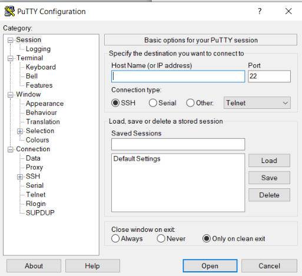

- **MobaXterm:** full tính năng, dễ dùng, đặc biệt khi cần kéo file hoặc mở nhiều tab cùng lúc, hỗ trợ nhiều giao thức: SSH, RDP, FTP, VNC...

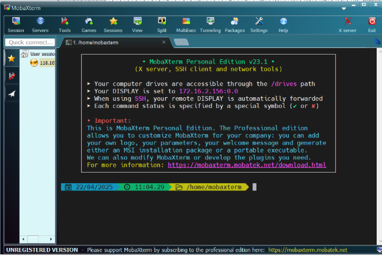

1. **Vitual studio code**
- **VS Code** là một **trình soạn thảo mã nguồn** do Microsoft phát triển.
  Nó dùng để **viết code, chỉnh sửa file, kết nối Git**, và cả **làm việc từ xa với server qua SSH**.

|**Tính năng chính**|**Mô tả**|
| :-: | :-: |
|Viết & chỉnh sửa code|PHP, HTML, CSS, JS, Python, Shell... đều được hỗ trợ|
|` `Mở & chỉnh sửa website|Mở thư mục mã nguồn để chỉnh sửa giao diện, chức năng, cấu hình...|
|` `Kết nối GitHub/Git|Dùng để **clone, đẩy lên GitHub**, commit, push/pull...|
|` `Làm việc từ xa với server|Dùng **Remote SSH** để kết nối và chỉnh file trực tiếp trên VPS|
|` `Cài extension|Có kho tiện ích mở rộng khổng lồ (FTP, SFTP, Prettier, Emmet...)|

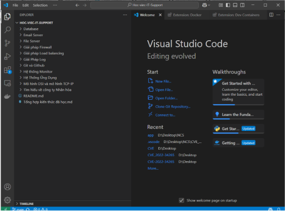

1. **Draw.io**

**Draw.io** (tên mới: **diagrams.net**) là **công cụ vẽ sơ đồ online miễn phí**, giúp bạn ta

- Sơ đồ mạng
- Sơ đồ cấu trúc server/hosting
- Quy trình xử lý sự cố
- Lưu đồ (flowchart)
- Kiến trúc dịch vụ (web, email, cloud...)

1. **Tìm hiểu và sử dụng Github**
- **Git** là một hệ thống quản lý phiên bản (Version Control System) giúp theo dõi lịch sử thay đổi của mã nguồn (code), cho phép làm việc nhóm hiệu quả, quay lại các phiên bản cũ, và đồng bộ code giữa các máy.
- **Github** là một dịch vụ nổi tiếng cung cấp kho lưu trữ mã nguồn Git cho các dự án phần mềm. Github có đày đủ tính năng của Git, ngoài ra nó còn bổ sung những tính năng về social để các developer tương tác với nhau như :
- Là công cụ giúp quản lý source code tổ chức theo dạng dữ liệu phân tán.
- Giúp đồng bộ source code của team lên 1 server.
- Hỗ trợ các thao tác kiểm tra source code trong quá trình làm việc (diff, check modifications, show history, merge source, …)

- **Một số lệnh git cơ bản:**

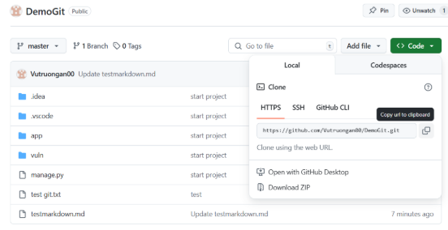

- Coppy mã nguồn trên github và clone về máy:

git clone <repo> → tải(nhân bản) mã nguồn từ Github về máy(local)

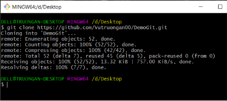

- Để thêm/sửa/xóa file/thư mục trên repo vừa clone về, sau đó push lên Github, trước tiên ta cần remote vào mã nguồn trên Github:

  git remote add origin <https://github.com/Vutruongan00/DemoGit.git>

sau đó chạy lệnh git remote –v để kiểm tra lại

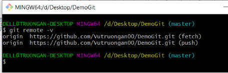

- Sau khi thêm/sửa/xóa các file/thư mục trên repo vừa clone về, lần lượt chạy từng lệnh sau:

git status → xem file nào thay đổi

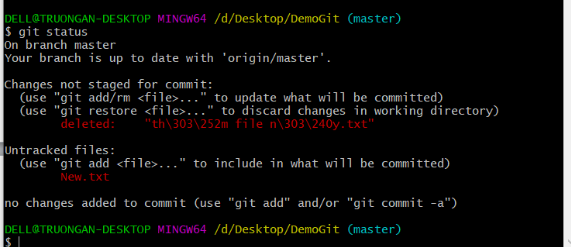

git add . → đưa file vào danh sách theo dõi

git commit -m "…." → ghi lại thay đổi

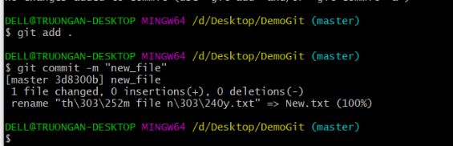

git push -u origin master  → đẩy lên GitHub

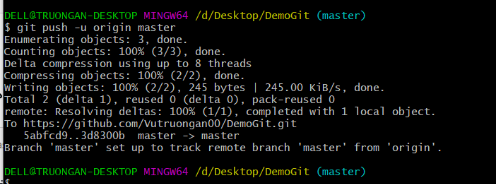

- Sau khi commit và đẩy lên Github:

  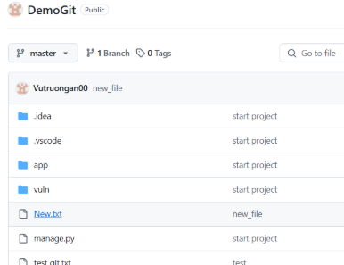

git pull → Kéo code mới nhất từ GitHub về máy

git log → Xem lịch sử commit 

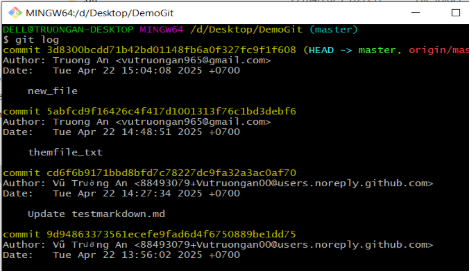

1. **Tìm hiểu và sử dụng Markdown**
- Markdown là ngôn ngữ đánh dấu văn bản thô được tạo ra bởi John Gruber.
- Văn bản được viết bằng Markdown sẽ có thể được chuyển đổi sang HTML và ngược lại.
- Thường được dùng để:
- tạo tập tin readme
- viết tin nhắn trên diễn đàn
- tạo văn bản có định dạng bằng một trình biên tập văn bản thô
- # **Các cú pháp thường sử dụng:**
  1. ## **Tạo tiêu đề**
Cú pháp:

\# Tiêu đề loại 1

\## Tiêu đề loại 2

\### Tiêu đề loại 3

\###### Tiêu đề loại 6

Kết quả:

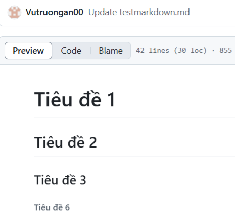

1. **Định dạng chữ**
- In nghiêng :  

  |**Cú pháp**|**Kết quả**|
  | :-: | :-: |
  |\*Từ cần in nghiêng 1\*|*Từ cần in nghiêng 1*|
  |\_Từ cần in nghiêng 2\_|*Từ cần in nghiêng 2*|

- In đậm:

  |**Cú pháp**|**Kết quả**|
  | :-: | :-: |
  |\*\*Từ cần in đậm 1\*\*|**Từ cần in đậm 1**|
  |\_\_Từ cần in đậm 2\_\_|**Từ cần in đậm 2**|

- Gạch ngang: ~~gạch ngang~~

  |**Cú pháp**|**Kết quả**|
  | :-: | :-: |
  |~~Khuyến mại~~|
Khuyến mại

|

  1. **Bảng - Table**

Để tạo bảng <table><tbody><tr><th><th>,bạn chỉ cần ngăn cách bởi dấu | và cách đầu bảng với thân bảng bằng :--- (số dấu - tuỳ ý)

Ví dụ: Cú pháp

|**Cú pháp**|**Kết quả**|
| :-: | :-: |
|
| Cột 1 | Cột 2 | Cột 3 | Cột 4 |

| :--- | :--- | :--- | :--- |

| A | B | C | D |

| E | F | G | H |

| I | K | L | M |

|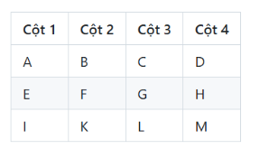|

