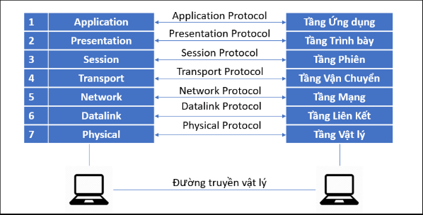

# **NHỮNG VIỆC ĐƯỢC TRIỂN KHAI**
1. Tìm hiểu 2 mô hình OSI và TCP/IP và so sánh chúng
2. Tìm hiểu về các giao thức mạng
# **ĐÃ HOÀN THÀNH**
## 1. **MÔ HÌNH  OSI và TCP/IP**
### 1.1. **Mô hình OSI**
   #### a. **Mô hình OSI là gì?**
   Là một mô hình lý thuyết được phát triển nhằm “chuẩn hóa việc kết nối và truyền thông giữa các hệ thống máy tính khác nhau qua mạng”. giúp các nhà phát triển thiết kế hệ thống và giao thức mạng có tính tương thích và mở rộng cao
   #### b. **Nguyên tắc định nghĩa các tầng hệ thống mở**
- Mô hình OSI tổ chức các giao thức truyền thông thành 7 tầng, mỗi tầng có thể có nhiều giao thức khác nhau và có nhiệm vụ riêng biệt và không trùng lặp.
- Giảm tối đa phụ thuộc giữa các tầng.
- Mỗi tầng chỉ cung cấp dịch vụ cho tầng trên và nhận dịch vụ từ tầng dưới.
- Đường biên rõ ràng giữa phần cứng và phần mềm: Tầng thấp thiên về phần cứng, tầng cao thiên về phần mềm.

   #### c. **Vai trò và chức năng chính các tầng**
**Tầng 1** - **Vật lý (Physical layer)**:
- Thực hiện chức năng chuyển tiếp dữ liệu từ kênh truyền nguồn tới kênh truyền đích. Dữ liệu trong tầng này được biểu diễn dưới dạng dãy bit nhị phân qua môi trường vật lý (cáp đồng, cáp quang, sóng vô tuyến).
- Xử lý tín hiệu điện, ánh sáng.
- Thiết bị: Hub, repeater, cáp mạng.
  
**Tầng 2** - **Liên kết dữ liệu (Data link layer)** 
- Ở tầng vật lý, dữ liệu được truyền qua các đường truyền vật lý (các loại cáp) nên không đảm bảo tính toàn vẹn và bảo mật. Khắc phục cho nhược điểm đó, “*tầng liên kết dữ liệu cung cấp các cơ chế kiểm tra lỗi, quản lý quyền truy cập và điều chỉnh việc truyền dữ liệu, giúp đảm bảo tính toàn vẹn và tin cậy của dữ liệu trên mạng*”.
- Đóng gói dữ liệu (Framing): Chia dữ liệu được nhận từ tầng mạng thành các khung (frames) nhỏ hơn để dễ dàng xử lý
- Định vị địa chỉ vật lý, kiểm tra lỗi (CRC), kiểm soát lưu lượng và kiểm soát truy cập
- Thiết bị: Switch, Bridge.                  -  Giao thức: Ethernet, PPP.
  
**Tầng 3** - **Mạng (Network layer)** 
- Định tuyến (routing), gán địa chỉ (IP).
- Truyền dữ liệu giữa các mạng khác nhau.
- Thiết bị: Router.               -  Giao thức: IP, ICMP.
  
**Tầng 4** - **Giao vận (Transport layer)**
- Đảm bảo truyền dữ liệu tin cậy (TCP) hoặc nhanh chóng (UDP).
- Phân mảnh và gom gói dữ liệu, kiểm soát lỗi, kiểm soát luồng kết nối, lưu lượng
- Giao thức: TCP, UDP.
  
**Tầng 5 - Phiên (Session layer)**
- Quản lý phiên kết nối giữa hai thiết bị (Thiết lập, duy trì, và kết thúc phiên truyền thông)
- Đồng bộ hóa: đảm bảo việc đồng bộ hóa dữ liệu giữa các quá trình giao tiếp
  
**Tầng 6 - Trình diễn (Presentation layer)**
- Chuyển đổi định dạng dữ liệu (nén, mã hóa, giải mã).
- Đảm bảo dữ liệu có thể đọc được giữa các hệ thống khác nhau.
- Ví dụ: SSL/TLS, chuyển đổi Unicode, nén MP3.
  
**Tầng 7 - ứng dụng (Application layer)**
- Giao tiếp trực tiếp với người dùng cuối hoặc phần mềm ứng dụng.
- Giao thức: HTTP, SMTP, FTP, DNS.
  
### 1.2 **Mô hình TCP/IP**
   a. **Mô hình TCP/IP là gì?**
   
TCP/ IP (Transmission Control Protocol/ Internet Protocol - Giao thức điều khiển truyền nhận/ Giao thức liên mạng), là một bộ giao thức trao đổi thông tin được sử dụng để truyền tải và kết nối các thiết bị trong mạng Internet. TCP/IP được phát triển để mạng được tin cậy hơn cùng với khả năng phục hồi tự động.

   b. **Mô hình phân tầng trong TCP/IP**

**Tầng 1 - Tầng vật lý/ liên kết mạng (Network Access/Link)**
- Nó là sự kết hợp của tầng Data Link và Physical trong mô hình OSI. Chịu trách nhiệm truyền dữ liệu giữa hai thiết bị trong cùng một mạng
- Có chức năng đóng gói dữ liệu vào frame, truyền qua cáp/sóng.
- Giao thức: Ethernet, Wi-Fi, ARP.
  
**Tầng 2 - Tầng mạng (Internet)**
- Gần giống như tầng mạng (Network layer) của mô hình OSI. Chịu trách nhiệm truyền tải dữ liệu một cách logic trong mạng
- Định tuyến (routing) và địa chỉ IP.
- Tạo và xử lý gói tin IP.
- Giao thức: IP (IPv4, IPv6), ICMP, IGMP
  
**Tầng 3 - Tầng Giao vận (Transport)**
- Chịu trách nhiệm duy trì liên lạc đầu cuối trên toàn mạng. Đảm bảo dữ liệu đến đúng ứng dụng, đúng thứ tự.
- Cung cấp truyền tin **tin cậy (TCP)** hoặc **nhanh, không đảm bảo (UDP )**.
  
**Tầng 4 - Tầng Ứng dụng (Application)**
- Đây là lớp giao tiếp trên cùng của mô hình. Tầng Ứng dụng đảm nhận vai trò giao tiếp dữ liệu giữa 2 máy khác nhau thông qua các dịch vụ mạng khác nhau (duyệt web, chat, gửi email, một số giao thức trao đổi dữ liệu: SMTP, SSH, FTP,...)
- Giao thức: HTTP, FTP, DNS, SMTP, Telnet, SSH, SNMP, DHCP.

   c. **Cách thức hoạt động của TCP/IP**

- Khi truyền dữ liệu , quá trình tiến hành từ tầng trên xuống tầng dưới, qua mỗi tầng dữ liệu được thêm vào thông tin điều khiển gọi là Header. Khi nhận dữ liệu thì quá trình xảy ra ngược lại, dữ liệu được truyền từ tầng dưới lên
- Ở đây, **IP** có vai trò quan trọng, nó cho phép các gói tin được gửi đến đích đã định sẵn, bằng cách thêm các thông tin dẫn đường (chính là Header) vào các gói tin để các gói tin được đến đúng đích đã định sẵn ban đầu.
- Giao thức **TCP** đóng vai trò kiểm tra và đảm bảo sự an toàn cho mỗi gói tin khi đi qua mỗi trạm. Trong quá trình này, nếu giao thức TCP nhận thấy gói tin bị lỗi, một tín hiệu sẽ được truyền đi và yêu cầu hệ thống gửi lại một gói tin khác.

   d. **Ưu điểm của mô hình TCP/IP**
- Không chịu sự kiểm soát của bất kỳ tổ chức nào => tự do trong việc sử dụng
- Có khả năng tương thích cao với tất cả các hệ điều hành, phần cứng máy tính và mạng => hoạt động hiệu quả với nhiều hệ thống khác nhau.
- Có khả năng mở rộng cao, có thể định tuyến => có thể xác định được đường dẫn hiệu quả nhất.
  
   e. **So sánh mô hình OSI và TCP/IP**

### **Giống nhau:** Mô hình OSI và TCP/IP có một số điểm chung như sau: 
- OSI và TCP/IP đều có kiến trúc phân lớp.
- OSI và TCP/IP đều có lớp Network và lớp Transport.
- OSI và TCP/IP cùng sử dụng kỹ thuật chuyển Packet.
  
### **Khác nhau:**

|**Nội dung**|**Mô hình OSI**|**Mô hình TCP/IP**|
| :- | :- | :- |
|**Độ tin cậy và phổ biến**|Nhiều người cho rằng đây là mô hình cũ, chỉ để tham khảo, số người sử dụng hạn chế hơn so với TCP/IP|Được chuẩn hóa, nhiều người tin cậy và sử dụng phổ biến trên toàn cầu|
|**Phương pháp tiếp cận**|Tiếp cận theo chiều dọc|Tiếp cận theo chiều ngang|
|**Sự kết hợp giữa các tầng**|Mỗi tầng khác nhau sẽ thực hiện một nhiệm vụ khác nhau, không có sự kết hợp giữa bất cứ tầng nào|Trong tầng ứng dụng có tầng trình diễn và tầng phiên được kết hợp với nhau|
|**Thiết kế**|Phát triển mô hình trước sau đó sẽ phát triển giao thức|Các giao thức được thiết kế trước sau đó phát triển mô hình|
|**Số lớp (Tầng)**|7|4|
|**Truyền thông**|Hỗ trợ cả kết nối định tuyến và không dây|Hỗ trợ truyền thông không kết nối từ tầng mạng|
|**Tình phụ thuộc**|Giao thức độc lập|Phụ thuộc vào giao thức|

## 2. **CÁC GIAO THỨC MẠNG**
### 2.1. **Giao thức mạng là gì?**

\- Giao thức mạng (Protocol) còn được gọi là giao thức truyền thông (Communication Protocol) là 1 tập hợp các quy tắc & thỏa thuận được sử dụng trong các tình huống giao tiếp hoặc trao đổi thông tin giữa các hệ thống, ứng dụng hoặc thiết bị khác nhau. 

\- Trong mạng máy tính, giao thức mạng (network protocol)** đóng vai trò như** ngôn ngữ chung giúp các thiết bị có thể giao tiếp, truyền tải và xử lý dữ liệu một cách hiệu quả và có tổ chức. Nếu không có các giao thức, máy tính và thiết bị mạng sẽ không thể “hiểu” được nhau, dẫn đến gián đoạn hoặc sai lệch trong quá trình truyền thông tin.

### 2.2. **Phân loại giao thức mạng (Theo mô hình OSI - 7 tầng)**

   1. **Tầng Ứng dụng (Application Layer)**

|**Giao thức**|**Vai trò**|**Ứng dụng**|
| :- | :- | :- |
|**HTTP / HTTPS**|Truy cập trang web (HTTPS có mã hóa)|Trình duyệt web (Chrome, Firefox)|
|**FTP / FTPS / SFTP**|Truyền file giữa máy và server|Upload source code lên hosting|
|**SMTP / POP3 / IMAP**|Gửi và nhận email|Outlook, Gmail, Mail Server|
|**DNS**|Chuyển tên miền thành địa chỉ IP|Gõ google.com → được chuyển thành IP|
|**SSH**|Truy cập máy chủ từ xa (mã hóa)|Quản trị Linux server bằng MobaXterm|
|**Telnet**|Truy cập từ xa không mã hóa (lỗi thời)|Kiểm tra cổng hoặc thiết bị mạng|
|**SNMP**|Quản lý, giám sát thiết bị mạng|Theo dõi router, switch, camera|
|**LDAP**|Xác thực người dùng trên mạng nội bộ|Active Directory trong doanh nghiệp|
|**NTP**|Đồng bộ thời gian giữa các thiết bị|Server luôn đúng giờ hệ thống|

   2. **Tầng Trình bày (Presentation Layer)**

|**Giao thức**|**Vai trò**|**Ứng dụng**|
| :- | :- | :- |
|**SSL / TLS**|Mã hóa bảo mật dữ liệu khi truyền|HTTPS, Email bảo mật|
|**MIME**|Định dạng dữ liệu media (ảnh, âm thanh...)|Đính kèm email, website đa phương tiện|

   3. **Tầng Phiên (Session Layer)**

|**Giao thức**|**Vai trò**|**Ứng dụng**|
| :- | :- | :- |
|**NetBIOS**|Kết nối chia sẻ tài nguyên qua LAN|Mạng nội bộ Windows|
|**RPC**|Gọi thủ tục từ xa (remote call)|Giao tiếp giữa dịch vụ|

   4. **Tầng Giao vận (Transport Layer)**

|**Giao thức**|**Vai trò**|**Ứng dụng**|
| :- | :- | :- |
|**TCP**|Truyền dữ liệu có kiểm soát, đầy đủ, đáng tin cậy|Web, email, truyền file|
|**UDP**|Truyền nhanh, không đảm bảo thứ tự|Livestream, game, VoIP|

   5. **Tầng Mạng (Network Layer)**

|**Giao thức**|**Vai trò**|**Ứng dụng**|
| :- | :- | :- |
|**IP (IPv4 / IPv6)**|Địa chỉ hóa và định tuyến dữ liệu|Mọi thiết bị cần IP để giao tiếp|
|**ICMP**|Gửi thông báo lỗi, kiểm tra kết nối|Ping, Traceroute|
|**ARP**|Tìm địa chỉ MAC từ địa chỉ IP|Giao tiếp trong LAN|
|**IPSec**|Mã hóa và bảo mật gói IP|VPN, bảo mật tầng mạng|

   6. **Tầng Liên kết Dữ liệu (Data Link Layer)**

|**Giao thức**|**Vai trò**|**Ứng dụng**|
| :- | :- | :- |
|**Ethernet**|Giao tiếp mạng nội bộ qua dây cáp|Mạng LAN, văn phòng|
|**PPP**|Truyền dữ liệu qua kết nối điểm-điểm|Kết nối modem|
|**Frame Relay / ATM**|Truyền dữ liệu trong mạng viễn thông|ISP, mạng doanh nghiệp lớn|

   7. **Tầng Vật lý (Physical Layer)**

(Ở tầng này không có giao thức cụ thể mà sử dụng các thiết bị vậy lý: dây cáp mạng,…)

### 2.3. **Một số giao thức phổ biến thường dùng trong thực tế**

1. **Trong WEB**
      
**HTTP (HyperText Transfer Protocol)**
- Khái niệm: Giao thức truyền tải siêu văn bản, giúp trình duyệt giao tiếp với máy chủ web để hiển thị trang web.
- Đặc điểm: Không mã hóa, dễ bị nghe lén.
- Cổng mặc định: 80
  
**HTTPS (HTTP Secure)**
- Là phiên bản bảo mật của HTTP, tích hợp mã hóa qua SSL/TLS để bảo vệ dữ liệu khi truyền tải.
- Ưu điểm: Mã hóa dữ liệu → an toàn khi đăng nhập, thanh toán.
- Cổng mặc định: 443
- Ví dụ: Truy cập ngân hàng online (https://acb.com.vn) đảm bảo thông tin cá nhân không bị rò rỉ.
  
**DNS (Domain Name System)**
- Khái niệm: Giao thức phân giải tên miền sang địa chỉ IP tương ứng.
- Chức năng: Cho phép người dùng gõ tên miền (như google.com) thay vì nhớ địa chỉ IP (vd: 142.250.207.46).
- Ví dụ: Khi ta vào facebook.com, DNS sẽ tự động tìm IP để trình duyệt kết nối đến máy chủ của FB
  
2. **Trong EMAIL**
   
**SMTP (Simple Mail Transfer Protocol)**
- Là giao thức **gửi** email từ client lên server hoặc giữa các mail server.
- Cổng mặc định: 25 (hoặc 587 với TLS)
- Vai trò: Gửi thư đi, không dùng để nhận thư.
- Ví dụ: Outlook gửi mail đi thông qua SMTP đến server Gmail.
  
**IMAP (Internet Message Access Protocol)**
- Là giao thức **nhận** email cho phép xem và quản lý email trực tiếp trên server.
- Ưu điểm: Thư không tải về máy → có thể xem ở nhiều thiết bị, đồng bộ hóa thư mục.
- Cổng mặc định: 143 (hoặc 993 nếu dùng SSL)
- Ví dụ: Bạn đọc email Gmail trên điện thoại, máy tính, vẫn thấy trạng thái đã đọc/đã xóa được đồng bộ.
  
**POP3 (Post Office Protocol v3)**
- Là giao thức nhận email bằng cách tải thư về thiết bị và xóa khỏi server.
- Đặc điểm: Không đồng bộ được như IMAP.
- Cổng mặc định: 110 (hoặc 995 nếu dùng SSL)
- Ví dụ: Dùng Outlook tải email về máy tính, sau đó không thấy thư trên web Gmail nữa.
  
3. **Trong quản trị hệ thống**
   
**SSH (Secure Shell)**
- Là giao thức truy cập và quản trị máy chủ từ xa thông qua kết nối mã hóa.
- Ưu điểm: Bảo mật cao, thay thế Telnet cũ.
- Cổng mặc định: 22
- Ví dụ: Dùng MobaXterm hoặc PuTTY để SSH vào máy chủ Linux quản lý hosting tại công ty Nhân Hòa

**FTP (File Transfer Protocol)**
- Khái niệm: Giao thức truyền tải file giữa client và server.
- Cổng mặc định: 21
- Nhược điểm: Không mã hóa, dễ bị đánh cắp dữ liệu → thường được thay thế bằng SFTP hoặc FTPS.
- Ví dụ: Dùng FileZilla để upload source code lên hosting.
  
4. **Trong giám sát mạng**
     
**SNMP (Simple Network Management Protocol)**
- Khái niệm: Giao thức dùng để giám sát, quản lý thiết bị mạng như router, switch, server.
- Vai trò: Thu thập thông tin trạng thái thiết bị, cảnh báo khi có lỗi hoặc vượt ngưỡng tài nguyên.
- Ví dụ: Hệ thống giám sát (Zabbix, PRTG) dùng SNMP để kiểm tra tình trạng hoạt động của thiết bị mạng trong doanh nghiệp.

