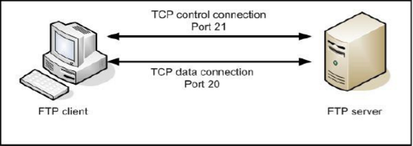
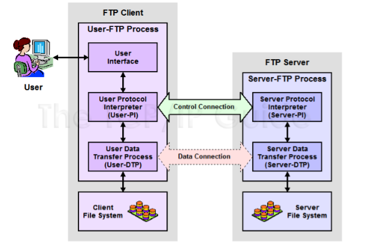
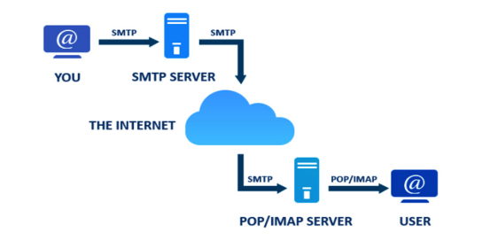
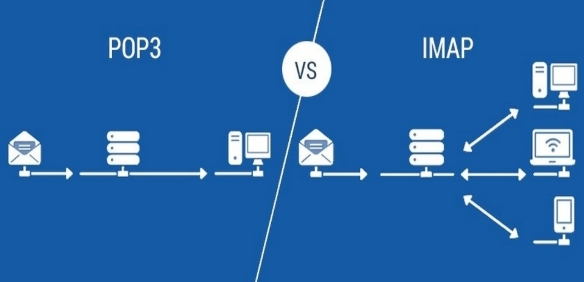

# **NHỮNG VIỆC ĐƯỢC TRIỂN KHAI**

1. **Giao thức truyền file – FTP**
   
2. **Thư tín điện tử (E-mail) trên Internet**
   
3. **Dịch vụ tên miền DNS**
   
# **ĐÃ HOÀN THÀNH**
## I - **Giao thức truyền file FTP**
### 1. **Khái niệm**
- Giao thức FTP (File Transfer Protocol) là một giao thức trao đổi file khá phổ biến hiện nay, nó được sử dụng nhiều nhất vào mục đích truyền tải dữ liệu.
- Mục đích sử dụng: 
- Được sử dụng để trao đổi tập tin qua mạng lưới truyền thông sử dụng TCP/IP (internet, mạng nội bộ, ...)
- Sử dụng để tải lên (upload) tệp từ máy tính lên server hoặc tải xuống (download) tệp từ server về máy tính
- Quản lý tệp trên server từ xa (đổi tên, xóa, tạo thư mục…).
### 2. **Hoạt động của FTP**
   #### 2.1. **Mô hình hoạt động của FTP**
- Giống như hầu hết các giao thức TCP/IP, nó dựa trên mô hình **Client – Server:**
  - Client là bên gửi yêu cầu (ví dụ: FileZilla, WinSCP, trình duyệt web, lệnh FTP trong terminal).
  - Server là nơi lưu trữ file, xử lý yêu cầu truyền file.
- Tuy nhiên, khác với các ứng dụng khác chạy trên nền TCP/IP,  

  FTP cần tới **2 kết nối TCP :**

  - **Control connection (Kênh điều khiển)** - Sử dụng cổng 21: Đây là kết nối TCP logic chính được tạo ra khi phiên làm việc được thiết lập. Nó được duy trì trong suốt phiên làm việc và chỉ cho các thông tin điều khiển đi qua ví dụ như lệnh và trả lời. Nó không được sử dụng để gửi dữ liệu.
  - **Data connection (Kênh dữ liệu)** - Sử dụng cổng 20: Mỗi khi dữ liệu được gửi từ sever tới client hoặc ngược lại, một kết nối dữ liệu TCP riêng biệt được thiết lập giữa chúng. Dữ liệu được truyền qua kết nối này. Khi hoàn tất việc truyền dữ liệu, kết nối được hủy bỏ.

*FPT gồm 2 đường: Kiểm soát và dữ liệu*

- Sự phân chia thành 2 kênh riêng biệt này tạo ra sự linh động trong cách hoạt động của FTP nhưng nó cũng tạo ra sự phức tạp cho FTP.
  #### 2.2. **Cấu trúc thành phần trong FTP**
- Do chức năng điều khiển và dữ liệu được truyền tải bằng cách sử dụng các kênh riêng biệt nên mô hình FTP chia phần mềm trên mỗi thiết bị thành 2 thành phần giao thức logic chịu trách nhiệm cho mỗi kênh:
  - **Thành phần Protocol Interpreter (PI):** Là thành phần quản lý kênh điều khiển, phát và nhận lệnh và trả lời.
  - **Thành phần Data Transfer Process (DTP):** chịu trách nhiệm gửi và nhận dữ liệu giữa client và server.

#### 2.3. **Tiến trình hoạt động của từng phần trong mô hình FTP**
- **Tiến trình bên phía server:**
  - **Server Protocol Interpreter (Server-PI):** chịu trách nhiệm quản lý điều khiển kết nối trên server. Nó lắng nghe yêu cầu kết nối hướng từ users trên cổng dành riêng. Khi kết nối đã được thiết lập,nó nhận lện từ User-PI, gửi trả lời lại và quản lí tiến trình truyền dữ liệu trên server.
  - **Server Data Transfer Process (Server-DTP):** Làm nhiệm vụ gửi hoặc nhận file từ bộ phận User-DTP. Server DTP vừa làm nhiệm vụ thiết lập kết nối kênh dữ liệu và lắng nghe một kết nối kênh dữ liệu từ user. Nó tương tác với server file trên hệ thống cục bộ để đọc và chép file.
- **Các tiến trình bên phía Client:**
  - **User Interface:** Đây là chương trình được chạy trên máy tính,nó cung cấp giao diện xử lí cho người dùng. Nó cho phép sử dụng các lệnh đơn giản hướng tới người dùng, và cho phép người điều khiển phiên FTP theo dõi được các thông tin và kết quả xảy ra trong tiến trình.
  - **User Protocol Interpreter (User-PI):** Chịu trách nhiệm quản lý kênh điều khiển phía Client. Nó khởi tạo phiên kết nối FTP bằng việc phát hiện ra yêu cầu tới phía server-PI. Khi kết nối đã được thiết lập, nó xử lí các lệnh nhận được trên giao diện người dùng, gửi chúng tới Server-PI, và nhận phản hồi trở lại. Nó cũng quản lý tiến trình User-DTP.
  - **User Data Transfer Process (User-DTP):** là bộ phận DTP nằm ở phía người dùng, làm nhiệm vụ gửi hoặc nhận dữ liệu từ Server-DTP. User-DTP có thể thiết lập hoặc lắng nghe yêu cầu kết nối kênh dữ liệu trên server. Nó tương tác với thiết bị lưu trữ file phía client.

#### 2.4. **Các chế độ truyền dữ liệu**
- **Active Mode**: Server chủ động kết nối đến client để truyền dữ liệu.
  - Phía Server-DTP tạo kênh dữ liệu bằng cách mở một cổng kết nối tới User-DTP. Server sử dụng cổng đặc biệt được dành riêng cho kết nối dữ liệu là cổng số 20. Trên máy Client, cổng mặc định được sử dụng chính là cổng được sử dụng để kết nối điều khiển, nhưng Server sẽ thường chọn mỗi cổng khác nhau cho mỗi chuyển giao.
- **Passive Mode**: Client chủ động kết nối đến server để nhận dữ liệu.​
  - Server sẽ chấp nhận 1 yêu cầu kết nối dữ liệu được khởi tạo từ Client.
  - Server sẽ trả lời lại phía Client với địa chỉ IP cũng như địa chỉ cổng mà Server sẽ sử dụng.
  - Sau đó phía Server-DTP lắng nghe trên cổng này một kết nối TCP đến từ User-DTP.
  - Theo mặc định, phía Client sẽ sử dụng cùng cổng mà nó sử dụng cho Control Connection như trong trường hợp chủ động. Tuy nhiên, trong phương pháp này, Client cũng có thể chọn sử dụng một cổng khác cho Data Connection nếu cần thiết.

#### 2.5. **Các phương thức truyền dữ liệu**

Khi Client-DTP và Server-DTP thiết lập xong kênh dữ liệu, dữ liệu sẽ được truyền trực tiếp từ phía Client tới phía Server, hoặc ngược lại, tùy theo các lệnh được sử dụng. Do thông tin điều khiển được gửi đi trên kênh điều khiển, nên toàn bộ kênh dữ liệu có thể được sử dụng để truyền dữ liệu. FTP có ba phương thức truyền dữ liệu, đó là: stream mode, block mode, và compressed mode.

- **Stream mode:**
  - Dữ liệu truyền đi liên tiếp dưới dạng các byte không cấu trúc.
  - Thiết bị gửi chỉ đơn thuần đẩy luồng dữ liệu qua kết nối TCP tới phía nhận.
  - Không có trường tiêu đề nhất định
  - Không có cấu trúc dạng Header, nên việc báo hiệu kết thúc file sẽ đơn giản được thực hiện khi thiết bị gửi ngắt kênh kết nối dữ liệu khi đã truyền dữ liệu xong.
  - Được sử dụng nhiều nhất trong 3 phương thức trong triển khai FTP thực tế. Do:
    - Là phương thức mặc định và đơn giản nhất.
    - Là phương thức phổ biến nhất, vì nó xử lí các file chỉ đơn thuần là xử lí dòng byte, mà không cần để ý tới nội dung.
    - Không tốn 1 lượng byte “overload” nào để thông báo Header.
- **Block Mode:**
  - Phương thức truyền dữ liệu mang tính quy chuẩn hơn.
  - Dữ liệu được chia thành nhiều khối nhỏ và đóng gói thành các FTP block.
  - Mỗi block có 1 trường Header 3 byte: báo hiệu độ dài, và chứa thông tin về các khối dữ liệu đang được gửi.
  - Một thuật toán đặc biệt được sử dụng để kiểm tra các dữ liệu đã truyền đi. Và để phát hiện, khởi tạo lại đối với 1 phiên truyền dữ liệu đã bị ngắt kết nối.
- **Compressed mode (Chế độ nén)**
  - Phương thức truyền dữ liệu sử dụng 1 kỹ thuật nén đơn giản, là “run-lenght encoding (mã hóa chiều dài)” – có tác dụng phát hiện và xử lí các đoạn lặp trong dữ liệu được truyền đi để giảm chiều dài của toàn bộ thông điệp.
  - Thông tin sau khi được nén, sẽ được xử lí như Block mode, với trường Header.
  - Trong thực tế, việc nén dữ liệu thường được thực hiện ở chỗ khác, làm cho phương thức Compressed mode trở nên không cần thiết.
#### 2.6. Các kiểu dữ liệu hỗ trợ
- Các tập tin được coi như một tập hợp các byte. FTP không quan tâm nội dung tập tin, sẽ chỉ đơn giản là di chuyển các tệp tin, các byte cùng 1 thời điểm, từ nơi này sang nơi khác.
- Có bốn kiểu dữ liệu khác nhau được quy định trong chuẩn của FTP:
  - ASCII: Định nghĩa một file văn bản ASCII, với dòng được đánh dấu bởi một số loại dòng đánh dấu kết thúc như mô tả ở trên.
  - EBCDIC: Khái niệm tương tự như loại ASCII, nhưng đối với tập tin bằng cách sử dụng kí tự EBCDIC của IBM đặt.
  - Image: Các tập tin đã không có cấu trúc nội bộ chính thức và được gửi một byte tại một thời điểm mà không có bất kỳ xử lý; đây là chế độ "hộp đen" đã đã đề cập ở trên.
  - Local: Kiểu dữ liệu này được sử dụng để xử lý các tập tin có thể lưu trữ dữ liệu trong byte logic có chứa một số bit khác 8. Cách xác định loại này cùng với cách dữ liệu có cấu trúc cho phép dữ liệu được lưu trữ trên hệ thống đích một cách phù hợp với đại diện địa phương của nó.
#### 2.7. Tính bảo mật của FTP
- FTP truyền thông tin đăng nhập (username và password) dưới dạng văn bản thuần túy, dễ bị đánh cắp. Để tăng cường bảo mật, có thể sử dụng các biến thể như FTPS (FTP Secure) hoặc SFTP (SSH File Transfer Protocol).

  **TÓM GỌN LẠI:** 

1) **FTP (File Transfer Protocol)** là một giao thức mạng chuẩn được sử dụng để truyền tệp tin giữa máy tính cá nhân (client) và máy chủ (server) thông qua mạng TCP/IP (thường là Internet). Có chức năng:
   - Tải lên (upload) tệp từ máy tính lên server.
   - Tải xuống (download) tệp từ server về máy tính.
   - Quản lý tệp trên server từ xa (đổi tên, xóa, tạo thư mục…).
2) **Cách hoạt động của FTP:**
- **Mô hình Client – Server:**
  - Client là bên gửi yêu cầu (ví dụ: FileZilla, WinSCP, trình duyệt web, lệnh FTP trong terminal).
  - Server là nơi lưu trữ file, xử lý yêu cầu truyền file.
- **Quá trình hoạt động cơ bản:**
  - **Kết nối tới máy chủ FTP**: Client nhập địa chỉ IP/host, username, password.
  - **Xác thực**: Nếu đúng thông tin đăng nhập, server cho phép truy cập.
  - **Giao tiếp qua 2 kết nối TCP**:
    - **Cổng 21**: dùng để điều khiển (control connection).
    - **Cổng 20**: dùng để truyền dữ liệu (data connection).
- **Hai chế độ truyền:**
  - **Active Mode:** Client mở một cổng ngẫu nhiên để chờ kết nối từ Server**.**
  - **Passive Mode:** Server mở một cổng ngẫu nhiên để chờ Client kết nối đến (giúp vượt qua firewall dễ hơn).
- **Các phương thức truyền dữ liệu**
  - **Stream Mode:** Dữ liệu được truyền dưới dạng dòng byte liên tục.
  - **Block Mode:** Dữ liệu được chia thành các khối, mỗi khối có tiêu đề riêng.
  - **Compressed Mode:** Dữ liệu được nén trước khi truyền để tiết kiệm băng thông.
### 3. **Các câu lệnh FTP cơ bản**

|**Lệnh**|**Mô tả**|
| :- | :- |
|open <host>|Kết nối tới server FTP|
|user <username> <password>|Đăng nhập vào server|
|ls hoặc dir|Liệt kê file/thư mục trên server|
|cd <folder>|Chuyển thư mục trên server|
|lcd <folder>|Chuyển thư mục cục bộ (local)|
|get <filename>|Tải file từ server về máy|
|put <filename>|Tải file từ máy lên server|
|mget <file1> <file2>|Tải nhiều file về|
|mput <file1> <file2>|Tải nhiều file lên|
|delete <filename>|Xóa file trên server|
|mkdir <folder>|Tạo thư mục trên server|
|rmdir <folder>|Xóa thư mục trên server|
|bye hoặc quit|Thoát khỏi phiên làm việc FTP|

# II. **Thư tín điện tử (E-mail) trên Internet**

E-mail là phương tiện trao đổi thông điệp điện tử qua mạng Internet. Quá trình gửi và nhận email bao gồm hai giai đoạn chính:

- Gửi thư: dùng giao thức SMTP.
- Nhận thư: dùng giao thức POP3 hoặc IMAP.
## 1. **Giao thức SMTP**
### 1.1. **Khái niệm**
- **SMTP (Simple Mail Transfer Protocol)** là giao thức chuẩn TCP/IP được dùng để **gửi thư đi** từ một máy khách (email client) đến máy chủ thư (mail server) hoặc từ một máy chủ này đến một máy chủ khác
### 1.2. **Chức năng của SMTP**
- Cho phép gửi mail với số lượng lớn,nhanh mà không bị giới hạn như các hòm mail miễn phí
- SMPT Server giúp bạn thao tác gửi thư qua giao thức TCP hoặc IP
### 1.3. **Đặc điểm của SMTP**
- Giao thức hoạt động ở tầng ứng dụng trong mô hình OSI.
- Sử dụng port 25 (hoặc 587 cho kết nối có bảo mật TLS).
- Gửi mail theo mô hình **push** (đẩy mail từ người gửi đến server nhận).
- Không hỗ trợ tải thư về máy người dùng – chỉ dùng cho việc gửi.
### 1.4. **Phương thức hoạt động của SMTP**

- Người dùng nhập nội dung Email trên máy tính cá nhân - Client (Gmai, Outlook,…
- Ứng dụng email trên máy người gửi sử dụng SMTP để gửi thông điệp đến Mail Server của người nhận
- Mail Server lưu trữ tạm thời email
- Ứng dụng Email của người nhận sẽ truy xuất thư bằng IMAP hoặc POP3 và kéo nó về hộp thư để người nhận truy cập hoặc tải về
### 1.5. **So sánh SMTP và HTTP**
#### a. **Giống nhau:**
- **Lớp giao thức** : Cả SMTP và HTTP đều hoạt động ở lớp ứng dụng của bộ giao thức Internet, cho phép giao tiếp qua Internet.
- **Mô hình Client-Server** : Cả hai giao thức đều tuân theo kiến trúc Client-Server trong đó máy Client  khởi tạo yêu cầu và phía Server phản hồi các yêu cầu đó. 
  - Ví dụ, máy khách email gửi email bằng SMTP, trong khi trình duyệt web yêu cầu các trang web bằng HTTP.
#### b. **Khác nhau:**
- **Mục đích:**
  - SMTP được thiết kế riêng để gửi và chuyển tiếp tin nhắn email giữa các máy chủ. Nó chủ yếu được sử dụng để truyền email.
  - HTTP được sử dụng để truyền các tài liệu siêu văn bản, chẳng hạn như các trang web và là nền tảng của truyền thông dữ liệu trên World Wide Web (www).
- **Định dạng dữ liệu:**
  - SMTP truyền dữ liệu ở định dạng văn bản thuần túy, được cấu trúc theo một cách cụ thể (có tiêu đề và nội dung) để tạo điều kiện thuận lợi cho việc liên lạc qua email.
  - HTTP có thể truyền nhiều loại dữ liệu khác nhau (văn bản, hình ảnh, video, v.v.) và sử dụng các loại MIME trong tiêu đề để chỉ định loại nội dung được gửi.

|**Tiêu chí**|**SMTP**|**HTTP**|
| :- | :- | :- |
|Mục đích|Gửi email|Truy cập trang web|
|Kiểu giao tiếp|Giao tiếp **hai chiều**, có lưu trạng thái giữa các phần liên quan (headers, nội dung, đính kèm...)|Giao tiếp **một chiều**, không lưu trạng thái|
|Giao thức push/pull|Push|Pull|
|Port mặc định|25 (587 nếu bảo mật)|80 (443 nếu HTTPS)|
|Dữ liệu truyền|Thường là văn bản, đính kèm file|HTML, hình ảnh, video, JS, CSS,...|

## 2. **Giao thức truy nhập mail: POP3 và IMAP**
### 2.1. **Giao thức POP3 (Post Office Protocol version 3)**
#### a. **Khái niệm:** 

**POP3** (**Post Office Protocol version 3)** là một giao thức dùng để **tải email từ máy chủ thư (mail server) về máy tính cá nhân (client)**. POP3 hoạt động theo cơ chế **pull**, nghĩa là client sẽ chủ động kết nối đến mail server để lấy thư.

#### b. **Cách thức hoạt động của POP3**

Khi người dùng muốn đọc email, chương trình  Email của họ sẽ sử dụng giao thức **POP3** để kết nối đến máy chủ email và tải xuống email về máy tính cá nhân. Thông thường, email sẽ bị xóa khỏi máy chủ sau khi đã được tải xuống. POP3 không hỗ trợ đồng bộ hóa email trên nhiều thiết bị vì nó chỉ tải email về một thiết bị và xóa chúng từ máy chủ.

#### c. **Ưu điểm của POP3**
- Tiết kiệm dung lượng, tài nguyên trên máy chủ-> tăng hiệu xuất hệ thống
- Truy cập ngoại tuyến dễ dàng: khi tải về có thể đọc mà không cần mạng
- Sử dụng đơn giản, dễ triển khai
- Đảm báo tính riêng tư
#### d. **Nhược điểm của POP3**
- Không có tính đồng bộ: không thể xem tin nhắn trên các thiết bị khác
- Nguy cơ mất dữ liệu nếu emai bị xóa khỏi máy chủ và thiết bị cá nhân bị hỏng sẽ không thể phục hồi
- Không hỗ trợ đầy đủ chức năng quản lý Email

### 2.2. **IMAP (Internet Message Access Protocol)**
#### a. **Khái niệm**
- **IMAP** (Internet Message Access Protocol) là một giao thức mạng được sử dụng trong hệ thống email **để truy cập** và **quản lý hộp thư từ xa** trên máy chủ thư. 
- Khác với POP3 thì IMAP cho phép người dùng duy trì trạng thái tin nhắn trên máy chủ giúp đồng bộ và quản lý được hộp thư hiệu quả trên nhiều thiết bị.
#### b. **Cách thức hoạt động của IMAP**
- **IMAP** hoạt động dựa trên mô hình Client-Server,  trong đó người dùng (client) truy cập và quản lý hộp thư trên máy chủ thư (server). Dưới đây là cách thức hoạt động cơ bản của IMAP:
  - **Thiết lập kết nối**: Người dùng sử dụng một ứng dụng email hoặc chương trình khách IMAP để thiết lập kết nối với máy chủ thư sử dụng giao thức IMAP. Cổng TCP/IP 143 được sử dụng cho kết nối không được mã hóa và cổng 993 được sử dụng cho kết nối được mã hóa bằng SSL/TLS.
  - **Xác thực**: người dùng xác thực bằng **username/password**.
  - **Đồng bộ hóa hộp thư**: IMAP không tải toàn bộ nội dung email ngay lập tức, mà chỉ tải tiêu đề (subject, sender, thời gian…) và cấu trúc thư mục (Inbox, Sent, Trash...).
  - **Truy cập và quản lý tin nhắn**: Người dùng có thể xem danh sách, đọc, gửi, trả lời, chuyển tiếp và xóa tin nhắn, đánh dấu đã/chưa đọc. Các thao tác này sẽ được thực hiện trực tiếp trên máy chủ thư.
  - **Đồng bộ hóa trạng thái**: Mọi thao tác truy cập và quản lý tin nhắn  đều sẽ được cập nhật trên máy chủ. Điều này cho phép người dùng duy trì trạng thái tin nhắn giữa các thiết bị khác nhau
  - **Quản lý thư mục**: tạo xóa, đổi tên, di chuyển tin nhắn vào thư mục trong hộp thư àdễ dàng quản lý tin nhắn theo nhu cầu người dùng
#### c. **Ưu điểm/ Nhược điểm của IMAP**

|**Ưu điểm**|**Nhược điểm**|
| :- | :- |
|Đồng bộ giữa nhiều thiết bị|Cần phải có kết nối Internet|
|Truy cập thư từ mọi nơi|Tốn dung lượng lưu trữ trên máy chủ nếu không quản lý tốt|
|Dễ quản lý|Cấu hình phức tạp hơn POP3|
|Không lo mất email khi hỏng/mất thiết bị|Tải chậm nếu hộp thư quá lớn|
|Tương thích với các ứng dụng email hiện đại|Có nguy cơ bị lộ lọt thông tin nếu máy chủ không được bảo mật tốt hoặc bị tấn công|

### 2.3. **Sự khác biệt giữa POP3 và IMAP**

|**Tiêu chí**|**POP3**|**IMAP**|
| :- | :- | :- |
|**Tên đầy đủ**|Post Office Protocol version 3|Internet Message Access Protocol|
|**Mục đích**|Tải thư từ server về máy, lưu trữ cục bộ|Quản lý thư trực tiếp trên server|
|**Phương thức hoạt động**|Tải toàn bộ thư về máy, thường xóa khỏi server|Chỉ tải nội dung cần thiết, giữ thư trên server|
|**Đồng bộ hóa**|Không đồng bộ giữa các thiết bị|Đồng bộ hóa hoàn toàn giữa các thiết bị|
|**Làm việc offline**|Có thể đọc thư offline sau khi tải|Hạn chế nếu chưa tải thư|
|**Quản lý thư mục**|Không hỗ trợ|Hỗ trợ tạo thư mục, phân loại, gắn nhãn|
|**Tìm kiếm trên server**|Không hỗ trợ|Hỗ trợ tìm kiếm từ xa trên server|
|
**Độ an toàn** 

**dữ liệu**
|Dễ mất thư nếu thiết bị lỗi hoặc mất|An toàn hơn vì thư nằm trên server|
|**Port mặc định**|110 (POP3), 995 (POP3S – bảo mật SSL/TLS)|143 (IMAP), 993 (IMAPS – bảo mật SSL/TLS)|
|**Phù hợp với ai?**|Người dùng một thiết bị, cần lưu trữ cục bộ|Người dùng nhiều thiết bị, cần đồng bộ và linh hoạt|
|**Yêu cầu kết nối mạng**|Không cần thường xuyên|Cần kết nối mạng để hoạt động hiệu quả|
|**Tài nguyên máy chủ**|Tiết kiệm tài nguyên server|Tốn tài nguyên lưu trữ trên server|

## III. **Dịch vụ tên miền DNS**	
### 1. **Khái niệm**
- **DNS (Domain Name System)** là hệ thống phân giải tên miền. DNS là hệ thống cho phép thiết lập tương ứng giữa địa chỉ IP và tên miền trên Internet.
#### 1.1. **Chức năng của DNS**
- **Phân giải tên miền**: DNS chuyển đổi các tên miền dễ nhớ thành địa chỉ IP mà máy tính sử dụng để giao tiếp với nhau. Điều này giúp người dùng truy cập trang web mà không cần nhớ các địa chỉ IP phức tạp.
- **Quản lý tên miền**: DNS cho phép tổ chức và quản lý các tên miền, bao gồm việc đăng ký, cập nhật, và hủy bỏ tên miền. Nó giúp xác định quyền sở hữu và thông tin liên quan đến từng tên miền.
- **Cung cấp thông tin bổ sung**: Ngoài địa chỉ IP, DNS còn có thể cung cấp thông tin bổ sung như:
  - **Thông tin máy chủ thư (MX records):** Xác định máy chủ gửi và nhận email cho một tên miền.
  - **Thông tin về dịch vụ (SRV records)**: Cung cấp thông tin về các dịch vụ mạng khác nhau mà tên miền hỗ trợ.
  - **Thông tin về bảo mật (TXT records)**: Sử dụng để xác minh danh tính và cung cấp các thông tin bảo mật cho tên miền.
- **Tăng tốc độ truy cập**: DNS lưu trữ các bản ghi tên miền trong bộ nhớ cache, giúp tăng tốc độ truy cập cho các tên miền đã được tìm kiếm trước đó. Khi người dùng truy cập lại, máy chủ có thể trả lại địa chỉ IP mà không cần thực hiện yêu cầu đến các máy chủ DNS khác.
- **Đảm bảo tính khả dụng**: DNS có thể phân phối tải giữa nhiều máy chủ thông qua các bản ghi DNS, giúp cải thiện tính khả dụng và hiệu suất của các dịch vụ trực tuyến. Nếu một máy chủ không khả dụng, DNS có thể chuyển hướng yêu cầu đến máy chủ khác.
- **Cung cấp bảo mật**: DNS có thể tích hợp các tính năng bảo mật như DNSSEC (DNS Security Extensions) để bảo vệ chống lại các cuộc tấn công như giả mạo DNS (DNS spoofing) và đảm bảo rằng thông tin trả về từ máy chủ DNS là chính xác.
#### 1.2. **Cách thức hoạt động của DNS**
- **Yêu cầu DNS**: Khi bạn nhập một tên miền vào trình duyệt, máy tính của bạn sẽ gửi yêu cầu đến máy chủ DNS để tìm địa chỉ IP tương ứng với tên miền đó.
- **Máy chủ DNS cục bộ**: Nếu máy tính của bạn đã lưu trữ địa chỉ IP của tên miền trong bộ nhớ cache, nó sẽ sử dụng địa chỉ này ngay lập tức. Nếu không, yêu cầu sẽ được gửi đến máy chủ DNS cục bộ (thường là máy chủ của nhà cung cấp dịch vụ Internet).
- **Máy chủ DNS phân cấp**: Nếu máy chủ DNS cục bộ không có thông tin, nó sẽ gửi yêu cầu đến các máy chủ DNS phân cấp. Hệ thống DNS được tổ chức theo cấu trúc phân cấp như sau
  - **Máy chủ DNS gốc**: Xác định máy chủ DNS cho tên miền cấp cao hơn (như .com, .org, .net).
  - **Máy chủ DNS tên miền cấp hai**: Xác định máy chủ DNS cho miền cụ thể (như example.com).
- **Giải quyết địa chỉ IP**: Khi máy chủ DNS gốc hoặc cấp hai nhận được yêu cầu, nó sẽ tìm kiếm thông tin về tên miền và trả về địa chỉ IP tương ứng. Quá trình này có thể bao gồm nhiều bước, với nhiều máy chủ DNS khác nhau tham gia.
- **Trả kết quả**: Sau khi tìm thấy địa chỉ IP, máy chủ DNS sẽ gửi kết quả trở lại máy chủ DNS cục bộ, sau đó máy chủ này gửi kết quả về máy tính của bạn.
- **Kết nối đến máy chủ**: Giờ đây, máy tính của bạn có địa chỉ IP của trang web và có thể gửi yêu cầu đến máy chủ web để tải trang.
- **Lưu trữ trong bộ nhớ cache**: Thông tin về địa chỉ IP có thể được lưu trữ trong bộ nhớ cache của máy tính và máy chủ DNS trong một khoảng thời gian nhất định, giúp tăng tốc độ truy cập trong các lần tiếp theo.
#### 1.3. **Phân loại DNS Server và vai trò của nó**

   ### Các DNS Server bao gồm:

   1. **Root Name Server**: Là một tập hợp các máy chủ DNS trên toàn cầu,chịu trách nhiệm cho việc phân giải tên miền trên internet. Hiện có khoảng 13 DNS root Server trên toàn thế giới
      - DNS root Server quản lý tất cả các tên miền Top-level-domain (cấp cao nhất bao gồm .com, .org, .net, .gov, .edu, .vn, .us, .uk, .fr,…). Khi có yêu cầu phân giải một Domain Name thành một địa chỉ IP, client sẽ gửi yêu cầu đến DNS gần nhất (DNS ISP). DNS ISP sẽ kết nối tới DNS root Server để hỏi địa chỉ của Domain Name.
      - DNS root Server sẽ căn cứ và dựa vào các Top Level của tên miền và từ đó có những tài liệu hướng dẫn phù hợp để chuyển hướng cho khách hàng đến đúng địa chỉ cần truy vấn.** 
   2. **DNS Recursor (DNS Resolver)**: Là máy chủ trung gian nhận yêu cầu từ người dùng và thực hiện truy vấn trên các máy chủ khác để lấy thông tin. Nó sẽ truy vấn từ Root Name Server đến các TLD nameservers và cuối cùng là Authoritative nameservers cho đến khi tìm thấy địa chỉ IP của tên miền cần tìm. DNS Recursor giúp người dùng không cần phải tự truy vấn từng máy chủ mà chỉ cần gửi yêu cầu tới DNS Recursor.
   3. **TLD Name Server ( Top level domain name server)** là nơi lưu trữ thông tin về các tên miền cấp cao nhất (Top-Level Domain) như .com, .org, .net, hoặc các tên miền quốc gia như .vn (Việt Nam), .jp (Nhật Bản). Sau khi nhận được yêu cầu từ Root Name Server, TLD nameserver sẽ trả về địa chỉ của Authoritative nameserver tương ứng. TLD Nameserver là bước trung gian để chuyển hướng từ cấp Root Name Server đến Authoritative nameserve.
   4. **Authoritative Name Server:** Server này có chứa thông tin chính xác về tên miền cụ thể. Nó là điểm dừng cuối trong truy vấn và phân giải địa chỉ IP cần thiết cung cấp cho **DNS Recursor**.
      
#### 1.4. **Truy vấn phân cấp trong hệ thống DNS**

   DNS hoạt động theo cấu trúc phân cấp, từ gốc tới cụ thể:

- Khi người dùng nhập [www.google.com](http://www.google.com) vào thanh địa chỉ của trình duyệt và Enter Trình duyệt sẽ kiểm tra IP của  có được lưu trong bộ nhớ cache hay không. Nếu có sẽ truy cập ngay. Nếu không có trong Cache, trình duyệt sẽ gửi yêu cầu tới máy chủ DNS Resolver, sau đó:
1) **Root DNS Server**
- Resolver hỏi Root server: “Tôi muốn tìm [www.google.com](http://www.google.com)”
- Root server trả lời: “Tôi không biết chính xác, nhưng .com được quản lý bởi các server sau: ”
2) **TLD DNS Server (Top Level Domain - .com, .net, .org, ...)**
- DNS Resolver tiếp tục hỏi TLD server: “Tôi muốn tìm google.com”
- TLD server trả lời: “Google được quản lý tại Name Server này nè”
3) **Authoritative DNS Server**
- DNS Resolver hỏi tiếp Name Server của Google: “IP của www.google.com là gì?”
- Server trả lời: “Đây là IP của nó: 142.250.190.14”

   **Trả kết quả và lưu cache**

- Resolver gửi IP về cho trình duyệt.
- IP được lưu lại ở nhiều lớp cache để tăng tốc cho các truy vấn sau.

**[ Trình duyệt → Cache → Resolver → Root → TLD → Authoritative → IP → Trình duyệt → Web server ]**
