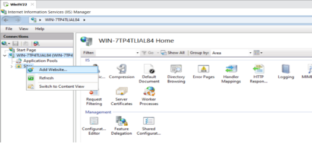
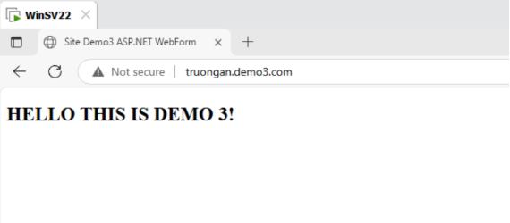

# **NHỮNG VIỆC ĐƯỢC TRIỂN KHAI**

[1. **Triển khai site demo1 html basic trên web server IIS**](#triển-khai-site-demo1-html-basic-trên-web-server-iis)
  
[2. **Triển khai site demo2 ASP classic trên IIS**](#triển-khai-site-demo2-asp-classic-trên-iis)
  
[3. **Triển khai site demo3 .net (3.5, 4.x) trên IIS**](#triển-khai-site-demo3-net-35-4x-trên-iis)
  
[4. **Triển khai site demo 4 .php trên IIS**](#triển-khai-site-demo-4-php-trên-iis)
   
# **ĐÃ HOÀN THÀNH**
## 1. **Triển khai site demo1 html basic trên web server IIS**
### 1.1 **Mục tiêu bài thực hành**
- Hiểu cách cài đặt và cấu hình IIS trên Windows Server.
- Biết cách tạo và triển khai một website tĩnh HTML lên IIS.
- Quản lý và kiểm tra hoạt động của website trên trình duyệt.
### 1.2. **Các bước triển khai**
#### **Tạo một thư mục chứa dự án HTML**:  C:\WebServer\Demo1-html
- Tạo file index.html chứa nội dung HTML đơn giản

#### **Thêm site mới trên IIS**
- Mở IIS Manager
- Chuột phải vào mục Sites > Add Website

- Nhập thông tin: à nhấn OK
  - Đặt tên site name, chọn đến Application Pool, (chọn .NET v4.5 hoặc DefaultAppPool), sau đó OK
  - Physical Path: chọn đến đường dẫn thư mục vừa tạo có chứa file web config: C:\WebServer\Demo1-html
  - IP Address: Để mặc định hoặc gõ đúng cái địa chỉ IP của localhost (ở đây là 127.0.0.1), Port 80 là mặc định, 
  - Hostname: tùy ý.  

 nhấn OK là đã tạo thành công site

- Để trang web chạy được cần chỉnh sửa file hosts: Vào đường dẫn: C:\Windows\System32\drivers\etc , mở file hosts lên và làm như sau:
  - 127.0.0.1: IP localhost 
  - truongan.demo1.com:  Host name chúng ta đã thêm trong quá trình tạo Site), Lưu ý bỏ dấu # trước dòng
  - Lưu lại là OK

- Mở trình duyệt gõ Host name chúng ta đã tạo, thì sẽ chạy được project Web của chùng ta

Thành công tạo Site demo1 html basic trên WebServer IIS

////////////////////////////////////////////////////////////////////////////////////////////////////////////////////////////////////

## 2. **Triển khai site demo2 ASP classic trên IIS**
### **Bước 1: Kích hoạt ASP Classic trong IIS**
- Mở Server Manager.
- Vào Manage → Add Roles and Features.

- Nhấn Next cho đến phần Roles, mở rộng Web Server (IIS) → Web Server → Application Development.
- Tích chọn mục “**ASP**”.

- Nhấn Next → Install để **kích hoạt ASP Classic trong IIS:**

### Bước 2: Tạo thư mục chứa source code ASP Classic** 

   (tương tự như ở Phần I)

- Tạo file source code đơn giản default.asp

### **Bước 3: Tạo site mới trong IIS**
- Các bước Add Website tương tự như ở Phần I

- Lưu ý khi tạo xong cần kiểu tra Default Document trong trong IIS như hình 

- Mở Default Document lên nếu không thấy chứa file source code vừa tạo thì add thêm hoặc cấu hình lại site để đảm bảm trang web hoạt động được. Nếu đầy đủ rồi thì ok

### **Bước 4: Cấu hình file hosts**

   Tương tự như bài trước cần cấu hình file hosts để chỉnh sửa **hostname** có thể truy cập được như lúc cấu hình site

   

- Kết quả: 

////////////////////////////////////////////////////////////////////////////////////////////////////////////////////////////////////

## 3. **Triển khai site demo3 .net (3.5, 4.x) trên IIS**
### **Bước 1: Cài đặt ASP.NET trên IIS và các thành phần cần thiết**
- Mở Server Manager → chọn "Add Roles and Features".
- Chọn các mục sau: và Install (như hình dưới)
  - **Web Server (IIS)**
    - .NET Framework 3.5 Features
    - .NET Framework 4.8 Features
- Trong phần **Web Server Role (IIS) → Role Services**, tích chọn:
  - **Application Development:**
    - .NET Extensibility 3.5
    - .NET Extensibility 4.8
    - ASP.NET 3.5
    - ASP.NET 4.8
    - ISAPI Extensions
    - ISAPI Filters
  - **Common HTTP Features:**
    - Static Content
    - Default Document
    - Directory Browsing
    - HTTP Errors
    - HTTP Redirection
  - **Security:**
    - Request Filtering
    - Windows Authentication (nếu cần)
  - **Management Tools:**
    - IIS Management Console

- Cài đặt xong khởi động lại Server

### **Bước 2: Chuẩn bị mã nguồn website (tạp thư mục chứa site)**

   (Tương tự như các phần trước)

### **Bước 3: Tạo website mới trong IIS**

** Kết quả:** 

////////////////////////////////////////////////////////////////////////////////////////////////////////////////////////////////////

## **4. Triển khai site demo 4 .php trên IIS**

### **Bước 1: Cài đặt PHP cho IIS**
- Tải PHP từ <https://windows.php.net/download/>, lựa chọn phiên bản phù hợp (ở đây mình chọn bản 8.2.28)

- Giải nén vào thư mục, ví dụ: **C:\PHP**

### **Bước 2: Cấu hình IIS Handler Mapping** 

   (Do Web Platform Installer (Web PI) đã dừng hoạt động từ năm 2022 nên ta cần cấu hình IIS Handler Mapping để chạy file **.php** thủ công trên IIS)

- Mở IIS Manager **à** chọn site muốn cấu hình **à** chọn **Handler Mappings**

- Điền thông tin Mapping:

### **Bước 3: Cấu hình thêm cho FastCGI**
- Quay lại giao diện chính của site à Mở **FastCGI Settings**

- Click đúp vào dòng  php-cgi.exe và thêm các biến sau:

- Sau khi cấu hình xong **Restart IIS** để hoàn tất
### **Bước 4: Tạo thư mục chứa site (file mã nguồn)**
- Tương tự như các phần trước, tạo 1 file **index.php** trong thư mục vừa tạo

### **Bước 5: Tạo website mới trong IIS**

### **Bước 6: Cấu hình file hosts**

- **Truy cập web site è kết quả:**

