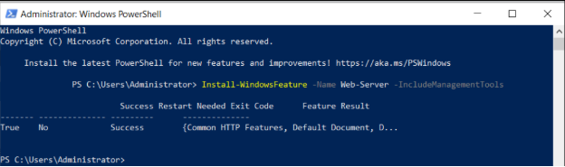
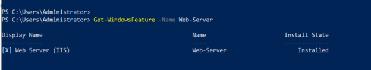
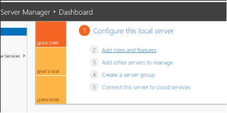
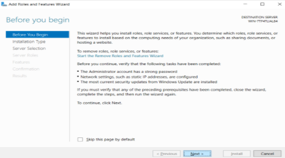
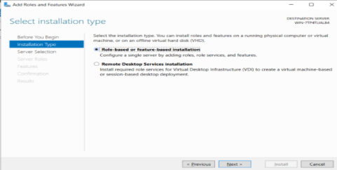
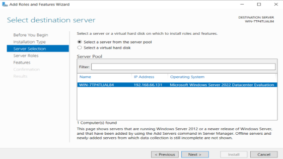
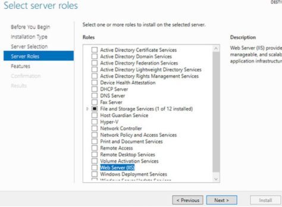
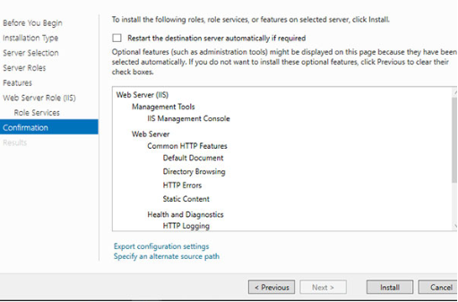
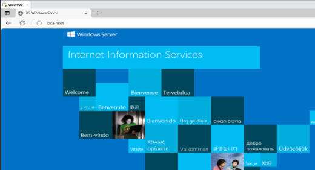

## **Môi trường và công cụ sử dụng**
- Hệ điều hành: Windows Server 2022
- Dịch vụ web: Internet Information Services (IIS)
- Trình duyệt: Microsoft Edge
## **Cài đặt IIS trên Windows Server**
### **Cách 1**: Dùng Powershell với quyền admin để cài đặt IIS
- Chạy lệnh sau để cài đặt IIS: 

  *Install-WindowsFeature -Name Web-Server -IncludeManagementTools*

- Kiểm tra việc cài đặt:  *Get-WindowsFeature -Name Web-Server*

*cài đặt thành công!*

### **Cách 2**: Cài đặt IIS bằng **Server Manager** trên Windows Server 2022
- ` `Chạy Server Manager và nhấp vào Add roles and features.

- Nhấn Next

- Chọn host bạn muốn thêm các service

- Tích vào hộp Web Server (IIS)

- Nhấn Next cho đến khi hiện hiện nút Install à click Install để hoàn tất cài đặt

- Chạy trình duyệt web và truy cập vào localhost, sau đó bạn có thể xác minh IIS có đang chạy bình thường không.

 
*Ok!*

