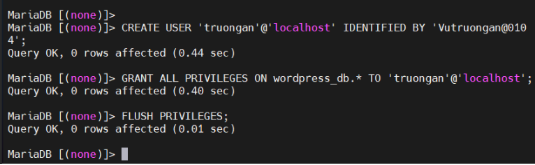
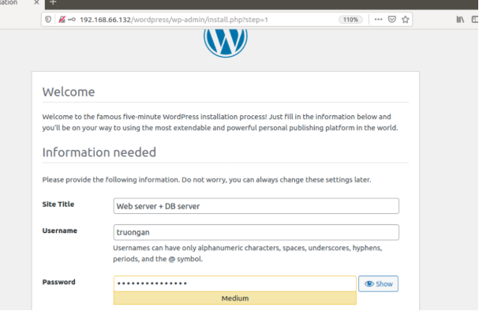

# **NHỮNG VIỆC ĐƯỢC TRIỂN KHAI**

1. **Triển khai site Wordpress trên LAMP stack**
   
2. **Triển khai site Wordpress LEMP stack**
   
3. **Triển khai site Wordpress tách biệt Web server, DB server**
   
4. **Viết bash script cài đặt LAMP, LEMP**
   
# **ĐÃ HOÀN THÀNH**
## 1. **Triển khai site Wordpress trên LAMP stack**
### **Bước 1: Cài đặt và cấu hình Apache2**

sudo apt update –y

sudo apt install apache2

### **Bước 2: Cài đặt MySQL**
- WordPress cần một cơ sở dữ liệu MySQL trống để lưu trữ dữ liệu của nó như bài đăng, loại bài đăng, hồ sơ người dùng, v.v. Vì vậy, bước tiếp theo sẽ là cài đặt máy chủ MySQL và tạo người dùng và cơ sở dữ liệu cho cài đặt WordPress 

sudo apt install mysql-server

sudo apt install mysql-client-core-5.7

### **Bước 3: Cài đặt PHP và các phần mở rộng**
- WordPress muốn giao tiếp với cơ sở dữ liệu MySQL và hiển thị nội dung động thì cần có PHP. Để cài đặt PHP, hãy chạy lệnh sau
- Sau đó, cài đặt các phần mở rộng PHP bổ sung cho WordPress bằng cách nhập lệnh
- Khi bạn yêu cầu một thư mục mà không chỉ định tên tệp, nó sẽ được hiển thị mặc định là index.html. Nếu bạn muốn tải index.php để thay thế, hãy chạy lệnh sau: và chỉnh sửa nội dung như sau:

  $ sudo nano /etc/apache2/mods-enabled/dir.conf

  

- Thay thế index.html bằng index.php và di chuyển index.cgi sang bên phải. Lưu tệp để tiếp tục.
- Khởi động lại máy chủ Apache bằng lệnh sau để thực hiện các thay đổi:

  $ sudo systemctl restart apache2

- Để kiểm tra xem PHP có hoạt động hay không, hãy tạo một tệp PHP mẫu, đặt tên là sample.php và thêm mã sau vào đó:

  <? php

  phpinfo ();

  ?>

  

- Thêm tệp này vào thư mục gốc của Apache là /var/www/html/. Để truy cập tệp, nhập http://192.168.66.132/Sample.php vào trình duyệt web

### **Bước 4: Thiết lập  MySQL cho WordPress**
- Trong quá trình cài đặt máy chủ cơ sở dữ liệu, bạn sẽ được nhắc đặt mật khẩu cho người dùng root MySQL.
- Sau khi cài đặt hoàn tất, kiểm tra phiên bản của máy chủ cơ sở dữ liệu MySQL đã cài đặt: mysql –V

`	`Output: mysql  Ver 14.14 Distrib 5.7.24, for Linux (x86\_64) using  EditLine wrapper

- Tiếp theo, đăng nhập vào máy chủ MySQL dưới dạng root người dùng và tạo cơ sở dữ liệu và người dùng MySQL mới: sudo mysql –u root -p

  *mysql> CREATE DATABASE wordpress;*

  *mysql> GRANT ALL PRIVILEGES ON wordpress.\* TO 'truongan'@'localhost' IDENTIFIED BY 'PASSWORD';*

  *mysql> FLUSH PRIVILEGES;*

  *mysql> exit;*

### **Bước 5: Chuẩn bị trước khi cài WordPress trên Ubuntu**
- Bắt đầu bằng cách tạo tệp cấu hình Apache WordPress.conf trong thư mục /*etc/apache2/sites-available*
- Tạo tiếp một thư mục cho WordPress trong */var/www/.* Đường dẫn đầy đủ sẽ là /*var/www/wordpress*.
- Mở WordPress.conf và kích hoạt .htaccess bằng cách thêm các dòng lệnh vào khối VirtualHost:

  *<Directory /var/www/wordpress/>*

  *AllowOverride All*  

  *</Directory>*

  

- Bật mod\_rewrite để sử dụng tính năng liên kết cố định của WordPress bằng cách chạy lệnh sau trong Terminal: 

  *$ sudo a2enmod rewrite*

  

  ➡ chạy: *sudo systemctl restart apache2*

- Tiếp theo Sửa file apache2.conf để cho phép WordPress dùng .*htaccess* Mở file cấu hình bằng Nano: *sudo nano /etc/apache2/apache2.conf*

  ` `Tìm đến đoạn sau (cuối file hoặc giữa file):

  *<Directory /var/www/>*

  `    `*Options Indexes FollowSymLinks*

  `   `*AllowOverride None*

  `    `*Require all granted*

  *</Directory>*

` `Sửa dòng AllowOverride None thành:  *AllowOverride All*

Điều này cho phép WordPress sử dụng file .htaccess để điều khiển URL.

- **Bước 6: Định cấu hình và cài đặt WordPress trên Ubuntu**
- cd vào thư mục:  /var/www/html
- Dán liên kết tải WordPress và giải nén tệp

  *$ wget https://wordpress.org/latest.zip* 

  

  -  #### **CẤU HÌNH CSDL** trong /var/www/html/wordpress/wp-config.php

\- Tệp wp-config.php cũng chứa các chi tiết cấu hình cơ sở dữ liệu ở trên cùng. Sử dụng các giá trị bạn đã đặt cho WordPress để thế DB\_NAME, DB\_USER và DB\_PASSWORD.

define(‘DB\_NAME’, ‘WordPressDB’);

/\*\* MySQL database username \*/

define(‘DB\_USER’, ‘WordPressUser’);

/\*\* MySQL database password \*/

define(‘DB\_PASSWORD’, ‘DB\_Password’);

Cuối cùng, add thêm phương thức hệ thống tệp ở dưới cùng:

define(‘FS\_METHOD’, ‘direct’);

Lưu tệp sau khi thực hiện các thay đổi.

- Cuối cùng cần thay đổi quyền sở hữu các tệp WordPress thành người dùng và nhóm www-data để đảm bảo mọi thứ hoạt động chính xác. Server Apache sẽ sử dụng nó: 
- Chạy lệnh sau để thay đổi quyền sở hữu:
- $ sudo chown -R www-data:www-data /var/www/wordpress
- Sau đó, cài đặt quyền chính xác cho các thư mục và tệp:

$ sudo find /var/www/wordpress/ -type d -exec chmod 750 {} \;

$ sudo find /var/www/wordpress/ -type f -exec chmod 640 {} \;

**Hoàn tất thiết lập thông qua trình duyệt web**

## 2. **Triển khai site Wordpress LEMP stack**
### **Bước 1:  CÀI ĐẶT NGINX Web Server**
- WordPress cần một máy chủ web có hỗ trợ PHP để chạy và kết xuất các trang web một cách linh hoạt. Đối với điều này, chúng tôi sẽ cài đặt và sử dụng máy chủ web Nginx. Nó có sẵn trong kho chính thức Ubuntu 18.04 và có thể dễ dàng cài đặt bằng lệnh sau: sudo apt -y install nginx
- Sau khi cài đặt hoàn tất, hãy khởi động Nginx và cho phép nó tự động bắt đầu sau khi khởi động lại:  systemctl start nginx        /      systemctl enable nginx

  

### **Bước 2: Cài đặt PHP 7 hỗ trợ cho Nginx**
- Để cài đặt PHP 7.x, bạn cần kích hoạt PPA cho PHP trên hệ thống Ubuntu của bạn bằng những tập lệnh sau: 

  ` `$ sudo apt-get install software-properties-common

  ` `$ sudo add-apt-repository ppa:ondrej/php

  sudo apt install php7.2-fpm php7.2-mysql php7.2-xml php7.2-curl php7.2-gd php7.2-mbstring php7.2-zip

- Mở file cấu hình Nginx mặc định /etc/nginx/sites-available/default bằng lệnh sau và chỉnh sửa:  sudo nano  /etc/nginx/sites-available/default
- - Để Nginx server có thể xử lý được các file kịch bản PHP (fastcgi script), bạn cần tìm đến giá trị location trong server block và thêm (bỏ dấu #) những dòng như dưới:

  location ~ \.php$ {

  `		`include snippets/fastcgi-php.conf;

         # With php-fpm (or other unix sockets):

  `		`fastcgi\_pass unix:/var/run/php/php7.3-fpm.sock;

  #       # With php-cgi (or other tcp sockets):

  #       fastcgi\_pass 127.0.0.1:9000;

  }

### **Bước 3: Cài đặt và cấu hình MySQL Database**

  (Tương tự như cài trên LAMP)

### **Bước 4: Cài đặt WordPress**
- wget https://wordpress.org/latest.zip
- Khi quá trình tải xuống kho lưu trữ WordPress hoàn tất, hãy giải nén nó vào thư mục gốc của tài liệu trên máy chủ của bạn

  unzip latest.zip -d /var/www/html/wordpress

### **Bước 5: Cấu hình NGINX**
- Trước tiên cần tạo một file cấu hình riêng trong thư mục /etc/nginx/sites-available/, ví dụ đặt là wordpress để  và thêm nội dung sau:  

  

- Kích hoạt khối ảo Nginx:

  Sudo ln -s /etc/nginx/sites-available/wordpress /etc/nginx/sites-enable/

- Cấu hình file /etc/nginx/sites-available/default  như sau:
- 
### **Bước 6: Chú ý CẤP QUYỀN cho wordpress**

sudo chown -R www-data:www-data /var/www/html/wordpress

sudo find /var/www/html/wordpress -type d -exec chmod 755 {} \;

sudo find /var/www/html/wordpress -type f -exec chmod 644 {} \;

- **Cấu hình thêm cả PHP-PFM** 

  sudo apt install php7.2-fpm

- **Hoàn tất cài đặt WordPress trên LEMP**

## 3. **Triển khai site Wordpress tách biệt Web server, DB server** 

Để triển khai một site WordPress với Web server và Database server tách biệt, ta sẽ cần chia hệ thống thành hai máy chủ riêng biệt, mục đích để tối ưu hóa hiệu suất và bảo mật:

**Môi trường triển khai**:

- Ubuntu 18.04 Desktop : Cài Web Server- Chạy Apache/Nginx và cài đặt PHP để xử lý các yêu cầu từ trình duyệt.
- Ubuntu Server: Cài Database Server: Chạy MySQL để lưu trữ và quản lý cơ sở dữ liệu của WordPress.
### **Bước 1: Cài WEBSERVER trên Ubuntu Desktop (Apache2-PHP-Wordpress)**

#### **Cài Apache2**  : (tương tự như phần I)

#### **Cài PHP**: (Tương tự phần I). Tuy nhiên sẽ phải cài thêm cả PHP 7.x-FPM (bước này rất quan trọng và rất hay lỗi nếu PHP 7.x-FPM không hoạt động thì Web sẽ không chạy được):

sudo apt install php7.2-fpm  

(Nếu lỗi)-->Kiểm tra tiến trình đang chạy; -->Nếu chắc chắn không có gì chạy → có thể gỡ khóa bằng tay:

#sudo rm /var/lib/dpkg/lock-frontend

#sudo rm /var/cache/apt/archives/lock

@sudo dpkg --configure -a

@sudo apt update 

-->sudo apt install php7.2-fpm

Và chắc chắn phải có file này trong /run/php: php7.2-fpm.stock

#### **Cài WORDPRESS:** 

wget https://wordpress.org/latest.zip

sudo apt install unzip -y

sudo unzip latest.zip -d /var/www/html/

#### **Cấp quyền cho Wordpress:** 

  sudo chown -R www-data:www-data /var/www/html/wordpress/

#### **Cấu hình WordPress:** 
  - Tạo file cấu hình: cp wp-config-sample.php wp-config.php 
  - Chỉnh sửa wp-config.php (ảnh):: điền thông tin database vừa tạo ở bên DATABASE SERVER
  - Chú ý Phần  Database hostname phải điền ip của máy database server (như ảnh)

#### **Cài đặt quyền truy cập**: chọn đúng thư mục lưu trữ gói cài đặt wordpress để cấp quyền cho Wordpress: /var/www/html/wordpress

  sudo chown -R www-data:www-data /var/www/html/wordpress

  sudo chmod -R 755 /var/www/html/wordpress

#### **Cấu hình Apache:** 

  Cấu hình VHOST file  wordpress.conf   trong  /etc/apache2/sites-available/   như sau:  sudo nano /etc/apache2/sites-available/wordpress.conf

  <VirtualHost \*:80>

  `    `ServerName localhost

  `    `DocumentRoot /var/www/html/wordpress

  `    `<Directory /var/www/html/wordpress>

  `        `AllowOverride All

  `    `</Directory>

  `    `ErrorLog ${APACHE\_LOG\_DIR}/error.log

  `    `CustomLog ${APACHE\_LOG\_DIR}/access.log combined

  </VirtualHost>

- Kích hoạt lại cấu hình: sudo a2ensite wordpress.conf
- Restart lại Apache2: sudo systemctl restart apache2
  
### **Bước 2: CẤU HÌNH DATABASE SERVER TRÊN UBUNTU SERVER**

#### **Cấu Hình MySQL**: Mở file cấu hình MySQL (/etc/mysql/mysql.conf.d/mysqld.cnf hoặc tương tự) và kiểm tra xem MySQL có đang lắng nghe trên cổng 3306 không:

  sudo nano /etc/mysql/mysql.conf.d/mysqld.cnf

#### Tìm dòng bắt đầu với bind-address và đảm bảo nó được thiết lập như sau: 

  `    `bind-address = 0.0.0.0

  

- Đăng nhập Mysql bằng user root** để cấp quyền cho user truongan**:**

  mysql -u root -p

  GRANT ALL PRIVILEGES ON \*.\* TO 'truongan'@'192.168.66.132' 

  192\.168.66.132' //[Đây là ip máy chủ web apache cần trỏ tới]

  IDENTIFIED BY 'Vutruongan@0104';

  FLUSH PRIVILEGES;

- KIỂM TRA KẾT NỐI TỪ WEB SERVER VỚI DATABASE SERVER

  Từ máy chủ WEB APACHE dùng lệnh sau để kiểm tra:

  sudo mysql -h 192.168.66.134 -u  truongan  -p

Cấu hình hoàn tất!

- **Truy cập Wordpress từ máy chủ Web :  [http://192.168.66.132/wordpress**](http://192.168.66.132/wordpress)**

## 4. **Bash script Install LAMP, LEMP**
### 1. **LAMP STACK**
- **Tạo 1 file script**: nano install\_lamp.sh và nhập nội dung như dưới đây:

  

- **Cấp quyền thực thi**: chmod +x install\_lamp.sh
- **Chạy script**:  ./install\_lamp.sh

### 1. **LEMP STACK**

   Tương tự tạo 1 file script**  install\_lemp.sh

   

