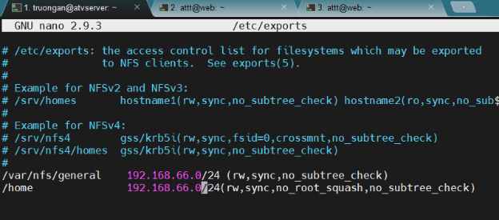

# **Tìm hiểu về Linux**
### 1. **Tổng quan về Linux**
- Linux là một hệ điều hành mã nguồn mở, dựa trên Unix.
- Được phát triển lần đầu bởi Linus Torvalds vào năm 1991.
- Linux thường dùng cho máy chủ, hệ thống nhúng, thiết bị mạng, và cả desktop.
- Hệ điều hành Linux được xây dựng dựa trên nhân Linux (Linux kernel)linh hoạt, có tích hợp nhiều tiện ích và phần mềm mã nguồn mở, cho phép doanh nghiệp quản lý tập tin, quản lý hệ thống, truy cập Internet, lập trình và thực hiện nhiều chức năng khác.
### 2. **Kiến trúc hệ thống Linux**
- Về cơ bản thì kiến trúc của HĐH Linux chia làm 3 thành phần: **Kernel, Shell, Applications.**

|**Thành phần**|**Mô tả**|
| :-: | :-: |
|**Kernel**|Là nhân hệ điều hành, quản lý phần cứng (CPU, RAM, thiết bị ngoại vi...) và cung cấp dịch vụ cho các phần còn lại.|
|**Shell**|Là giao diện giữa người dùng và Kernel, nhận lệnh từ người dùng và truyền cho Kernel. Có thể là dòng lệnh (bash, zsh...) hoặc đồ họa (GUI).|
|**Applications**|Là các phần mềm mà người dùng chạy trên Linux, sử dụng dịch vụ do Kernel cung cấp thông qua Shell.|

- Ngoài ra cũng có thể bóc tách **kiến trúc Linux theo phân lớp hệ thống** , từ lúc máy bật đến khi dùng ứng dụng: **thành 7 tầng:** 

|**Lớp**|**Chức năng chính**|
| :-: | :-: |
|**Bootloader**|Quản lý quá trình khởi động máy tính và nạp Kernel vào RAM|
|**Kernel**|Nhân hệ điều hành, quản lý tài nguyên và cung cấp các API hệ thống|
|**Init System**|Quản lý tiến trình khởi động hệ thống, khởi tạo dịch vụ (Systemd, SysVinit...)|
|**Daemons**|Tiến trình chạy nền, cung cấp dịch vụ (cron, networkd...)|
|**Graphical Server**|Quản lý hiển thị đồ họa (X server, Wayland...)|
|**Desktop Environment**|Giao diện người dùng (GNOME, KDE...), cung cấp công cụ quản lý tệp, ứng dụng, cài đặt|
|**Applications**|Các phần mềm cụ thể người dùng chạy (Firefox, LibreOffice, VS Code...)|

### 3. **Các bản phân phối (distro) Linux phổ biến**
- **Ubuntu**: Thân thiện, dễ dùng, phổ biến nhất cho người mới.
- **Debian**: Ổn định, thích hợp cho server.
- **RedHat Enterprise Linux (RHEL):** An toàn, bảo mật cao, sẵn sàng đáp ứng khối lượng tính toán cường độ cao. RHEL được triển khai trong các cơ quan chính phủ, tài chính – ngân hàng
- **CentOS/AlmaLinux/Rocky Linux**: Bản clone của RHEL, phù hợp cho môi trường doanh nghiệp.
- **Arch Linux**: Tùy biến cao, dành cho người dùng nâng cao.
- **Kali Linux**: Dành cho pentest/an ninh mạng.

### 4. **Ưu nhược điểm của hệ điều hành Linux** 
- **Ưu điểm:**

|**Ưu điểm**|**Mô tả**|
| :-: | :-: |
|**Miễn phí & mã nguồn mở**|Linux là hệ điều hành mã nguồn mở, người dùng và tổ chức có thể sử dụng, chỉnh sửa, phân phối mà không phải trả phí.|
|**Bảo mật cao**|Linux ít bị virus và mã độc nhắm đến, nhờ hệ thống phân quyền rõ ràng, cộng đồng cập nhật bảo mật thường xuyên.|
|**Ổn định và đáng tin cậy**|Linux có thể hoạt động liên tục hàng tháng, thậm chí nhiều năm không cần khởi động lại. Thích hợp cho server.|
|**Hiệu suất cao**|Linux nhẹ và linh hoạt, sử dụng tài nguyên hệ thống hiệu quả. Phù hợp cả với máy cấu hình yếu.|
|**Tùy biến mạnh mẽ**|Người dùng có thể tùy biến từ giao diện đến chức năng, thậm chí xây dựng bản phân phối riêng.|
|**Hỗ trợ đa người dùng**|Linux cho phép nhiều người dùng đăng nhập và làm việc cùng lúc mà không ảnh hưởng đến nhau.|
|**Cộng đồng lớn**|Có cộng đồng người dùng và nhà phát triển mạnh mẽ, nhiều tài liệu, diễn đàn, hỗ trợ miễn phí.|

- **Nhược điểm:**

|**Nhược điểm**|**Mô tả**|
| :-: | :-: |
|**Không thân thiện với người mới**|Linux, nhất là dòng không GUI, có thể khó sử dụng với người dùng chưa quen dòng lệnh.|
|**Khó cài đặt phần mềm chuyên dụng**|Một số phần mềm phổ biến trên Windows/Mac (như Adobe Photoshop, MS Office) không có bản chính thức trên Linux.|
|**Tương thích phần cứng đôi khi hạn chế**|Một số phần cứng đời mới hoặc hiếm có thể không có driver hỗ trợ tốt trên Linux.|
|**Yêu cầu kiến thức kỹ thuật**|Để khai thác tối đa Linux, người dùng cần biết các lệnh, cấu hình hệ thống, quản lý dịch vụ,...|
|**Không phù hợp cho game thủ**|Do ít game hỗ trợ hoặc hiệu năng không bằng Windows.|


# **Quản lý người dùng và nhóm trong Linux**
### 1. **Quản lý USER**
####   1.1. **User là gì?**
- User là tài khoản mà người dùng được cung cấp để thao tác với hệ thống.
- Mỗi tài khoản sẽ có quyền làm gì và không được làm gì.
- Tài khoản có quyền cao nhất là root và root có quyền làm tất cả
####  1.2. **File “/etc/passwd”**
- Là file văn bản chứa thông tin về các tài khoản user trên máy.
- Mỗi user đều có thể đọc tập tin này nhưng chỉ có user root mới có quyền thay đổi.
- Cấu trúc file: trong file /etc/passwd được chia làm 4 trường chính và mỗi trường cách nhau bởi dấu hai chấm.


Giải thích: 

- 1 - Tên user ( login name )
- 2 - Mật khẩu group đã được mã hóa ( vì có file /etc/shadow ) nên mặc định ở đây là x
- 3 - User ID ( uid )
- 4 - Group ID ( gid )
- 5 - Tên mô tả người sử dụng ( comment )
- 6 - Thư mục home của user ( thường là /home/user\_name )
- 7 - Loại shell sẽ hoạt động khi user login , thường là /bin/bash
####  1.3. **Thêm, sửa, xóa user**
- Ta có thể tạo user mới bằng lệnh “useradd” :  
``` 
useradd [options] [tên user] 
  - Options:
    - -m : đồng thời tạo thư mục ở home
    - -d : tên thư mục tạo ở home
    - -c : thêm mô tả về thư mục đó
```
- Xóa  user bằng lệnh ”userdel” :  
```
  userdel [options] [tên user]
  - Options:
- -m : dùng để xóa user
- -r : xóa user đồng thời xóa cả file mà user đó tạo ra
```
- Ta có thể chỉnh sửa user bằng lệnh “usermod”: usermod [options] [tên user]
- Options:
- -G: Thêm user vào group
- -c : thay đổi thông tin người dùng
- -e : thiết lập ngày hết hạn cho người dùng
- -L : Khóa tài khoản
- -U : mở khóa tài khoản
- -s : thay đổi shell script cho user usermod -s /usr/bin/truongan truongan
- Ta có thể tạo hoặc thay đổi password cho user bằng lệnh “passwd”. Chỉ có quyền root mới có thể thực hiện việc này:     passwd [user-name]
#### 1.4. **Chuyển đổi user**
- Khi ta muốn chuyển từ user này sang user khác ta có thể sử dụng lệnh “su” hoặc “sudo su”

  ``` sudo su [user-name] ```

### 2. **Quản lý group trong Linux**
#### 2.1. **Group là gì?**
- Group là một nhóm tập hợp các user.
- Mỗi group có 1 tên duy nhất và 1 mã định danh duy nhất (gid).
- Khi tạo ra 1 user ( không dùng option -g ) thì mặc định 1 group mang tên user được tạo ra.
  1. **File “/etc/group”**
- Là tập tin văn bản chứa thông tin về các group trên máy.
- Mỗi user đều có quyền đọc tập tin này nhưng chỉ có user root mới có quyền thay đổi.
- Cấu trúc file:


#### 2.2. **Các lệnh quản lý Group**
- Tạo 1 group ta sử dụng lệnh “groupadd”:   groupadd  [group\_name]
- Tạo mật khẩu cho group ta sử dụng lệnh “gpasswd”:   gpasswd [group\_name]
- Để sửa lại thông tin về group ta sử dụng lệnh “groupmod”: 

  groupmod [options] [group\_name]	

  - Options
    - g [gid] : sửa lại mã nhóm ( gid )
    - n [group\_name] : sửa lại tên group
- Để xóa group ta sử dụng lệnh “groupdel”: 	groupdel [group\_name]

### 2.3. **Owner (Chủ sở hữu) trong Linux**

Trong Linux, **mỗi tệp / thư mục** đều gắn với một **chủ sở hữu (Owner)** và một **nhóm (group)**. Chủ sở hữu có quyền điều khiển trực tiếp tới tệp, bao gồm **đọc (read), ghi (write), thực thi (execute)**, tùy theo quyền đã được gán.

### **Các loại Ownership trong Linux**
- Mỗi tệp hoặc thư mục có **3 loại phân quyền** dựa trên đối tượng:

|**Đối tượng**|**Mô tả**|
| :-: | :-: |
|**User (u)**|Là **chủ sở hữu** (owner) của tệp/thư mục.|
|**Group (g)**|Là **nhóm** mà tệp/thư mục thuộc về.|
|**Others (o)**|Là tất cả những **người dùng khác** trên hệ thống.|

Trong đó, **user** chính là **owner** – người đã tạo ra tệp/thư mục hoặc được chỉ định làm chủ.

### **Xem chủ sở hữu của tệp/thư mục**
- Dùng lệnh:  ls –l 
- Kết quả ví dụ : 	-rwxr-xr--  1  truongan  nhom1  1234  May 12 10:00 report.txt
  - Trong đó:  -   truongan -  là **owner** (người sở hữu) - có quyền rwx

`       `- nhom1 - là **group** (nhóm sở hữu) – có quyền  r-x

`   		       `-  Other là quyền truy cập (chỉ đọc) r--

### **Thay đổi chủ sở hữu**

Chỉ **user root** hoặc người có quyền  sudo mới được thay đổi owner: 

- Thay đổi chủ sở hữu:	sudo    chown   newuser   filename
- Thay đổi chủ sở hữu và nhóm:  sudo chown newuser:newgroup filename
### **Quyền của chủ sở hữu**
- Chủ sở hữu được gán **quyền truy cập** riêng biệt so với nhóm và người khác. Dạng quyền gồm:

### **Quyền truy cập (Permissions) trên file/folder**
- Permissions xác định quyền truy cập của người dùng đối với một tệp hay thư mục cụ thể.
- **Ba loại quyền cơ bản**: Read (R), Write (W), và Execute (X).

|**Quyền**|**Ký hiệu**|**Mô tả**|
| :-: | :-: | :-: |
|**Read**|r|Đọc nội dung file / Liệt kê nội dung thư mục|
|**Write**|w|Ghi (chỉnh sửa) file / Thêm, xóa file trong thư mục|
|**Execute**|x|Thực thi file / Truy cập vào thư mục|

- **Quyền áp dụng cho ba đối tượng**: Owner (Chủ sở hữu), Group (Nhóm), và Others (Người khác).

|**Đối tượng**|**Ký hiệu**|**Mô tả**|
| :-: | :-: | :-: |
|**User (u)**|u|Chủ sở hữu của file/thư mục|
|**Group (g)**|g|Nhóm mà file/thư mục thuộc về|
|**Others (o)**|o|Tất cả người dùng còn lại|
|**All (a)**|a|Áp dụng cho tất cả (user + group + others)|

- Dùng lệnh chmod để thay đổi quyền truy cập. 

  Ví dụ: chmod u+rwx,g+rw,o+r myfile**  - Cho phép chủ sở hữu có quyền đọc, ghi và thực thi, nhóm có quyền đọc và ghi, người khác có quyền đọc.

# **Các lệnh hữu ích trên Linux**
## 1. **Bộ soạn thảo trên linux: vi, nano**
   ### **Nano** 
- Nano là một trình soạn thảo văn bản dòng lệnh đơn giản được cài đặt theo mặc định trên hầu hết các hệ điều hành Linux. Nó là một công cụ tuyệt vời để tạo và chỉnh sửa các tệp văn bản, và nó cũng có thể được sử dụng để tạo các tệp cấu hình.
- Để mở trình soạn thảo Nano, hãy chạy lệnh sau trong thiết bị đầu cuối:  nano tên\_file

  VD:    nano myfile.txt

- Một số phím tắt Nano hữu ích:
  - Ctrl+X: Lưu file và thoát
  - Ctrl+C: Thoát mà không lưu
  - Ctrl+S: Lưu file
  - Ctrl+Q: Thoát khỏi Nano
  - A: Chuyển đến đầu tệp
  - E: Chuyển đến cuối tệp
  - B: Di chuyển một ký tự về phía trước
  - F: Di chuyển một ký tự về phía sau
  - D: Xóa một ký tự
  - C: Sao chép một ký tự
  - V: Dán một ký tự
  - Y: Sao chép dòng hiện tại
  - P: Dán dòng hiện tại
  - G: Chuyển đến dòng cuối cùng
  - 0: Chuyển đến ký tự đầu tiên của dòng hiện tại
  - $: Chuyển đến ký tự cuối cùng của dòng hiện tại
  - Backspace: Xóa ký tự phía trước con trỏ
  - Delete: Xóa ký tự phía sau con trỏ
  - Ctrl+A: Di chuyển đến đầu dòng
  - Ctrl+E: Di chuyển đến cuối dòng
  - Ctrl+B: Di chuyển một từ về phía trước
  - Ctrl+F: Di chuyển một từ về phía sau
  - Ctrl+U: Xóa dòng hiện tại
  - Ctrl+Y: Dán văn bản đã sao chép
  - Ctrl+K: Cắt dòng hiện tại
  - Ctrl+W: Xóa từ trước con trỏ
  ### **Vi/Vim**
- Vim là một trình soạn thảo văn bản dòng lệnh mạnh mẽ được cài đặt theo mặc định trên hầu hết các hệ điều hành Linux. Nó là một công cụ tuyệt vời để tạo và chỉnh sửa các tệp văn bản, và nó cũng có thể được sử dụng để tạo các tệp cấu hình.
- Mở file tương tự như dùng nano:   vi  file\_name

  VD: vi  myfile.txt

- Một số phím tắt Vi/Vim hữu ích:
  - i: Chèn văn bản
  - a: Chèn văn bản sau con trỏ
  - c: Xóa văn bản
  - d: Xóa văn bản
  - s: Thay thế văn bản
  - y: Sao chép văn bản
  - p: Dán văn bản
  - g: Di chuyển đến đầu dòng
  - gg: Di chuyển đến đầu tệp
  - G: Di chuyển đến cuối dòng
  - h: Di chuyển một ký tự về phía trước
  - j: Di chuyển một dòng xuống
  - k: Di chuyển một dòng lên
  - l: Di chuyển một ký tự về phía sau
  - w: Di chuyển một từ về phía trước
  - b: Di chuyển một từ về phía sau
  - n: Tìm kiếm tiếp theo
  - N: Tìm kiếm trước
  - /: Tìm kiếm
  - ?`: Tìm kiếm ngược
  - Shift+n: Tìm kiếm ngược
  - :h`: Hiển thị trợ giúp
  - :q`: Thoát
  - :w`: Lưu file
  - :wq`: Lưu và thoát

# **Process trong Linux**
- Trong Linux, **process (tiến trình)** là một chương trình đang được thực thi. Mỗi tiến trình có **PID (Process ID)** duy nhất và có thể được quản lý bằng nhiều công cụ khác nhau. Dưới đây là kiến thức tổng quan và các lệnh phổ biến về quản lý tiến trình trong Linux

  **Các lệnh về Process:**

###  **ps - process status**


- Dùng để quan sát các process đang chạy .
- Cấu trúc lệnh :    **# ps [options]**
- Options :
  - -f : hiển thị đầy đủ thông tin về các process
  - -e : hiển thị đầy đủ các process ( bao gồm cả system process )
  - -aux = -ef : hiển thị đầy đủ thông tin về tất cả các process
  - -u : hiển thị các process liên quan đến user hiện hành
  - -p PID : hiển thị thông tin process cụ thể
### **Top**
- Ý nghĩa tương tự lệnh ps


### **Kill**
- Là lệnh tắt process đang chạy.
- Khi sử dụng lệnh kill với một tiến trình con thì chỉ tiến trình đó được tắt nhưng nếu sử dụng kill với tiến trình cha thì toàn bộ con của nó cũng được tắt theo.
- Cú pháp:	# kill [options] [pid]
- Options:
  - -9 : kill toàn bộ các process liên quan
---

# **Network trong Linux**
   ### **Các lệnh cấu hình mạng Linux**

|**Lệnh**|**Mô tả**|
| :-: | :-: |
|hostname|Hiển thị tên hostname hiện tại.|
|ip|Hiển thị và cấu hình giao diện mạng, định tuyến và tunnel.|
|iwconfig|Hiển thị và cấu hình giao diện mạng không dây.|
|netplan|Cấu hình giao diện mạng bằng file YAML.|
|ifconfig|Hiển thị và cấu hình giao diện mạng hiện tại của hệ thống.|
|ifquery|Kiểm tra cấu hình hiện tại của giao diện mạng và các thông số.|
|nmcli|Quản lý và cấu hình kết nối mạng, kiểm tra trạng thái mạng, điều khiển NetworkManager.|
|ifup|Kích hoạt một giao diện mạng đang ở trạng thái tắt.|
|ifdown|Hủy kích hoạt một giao diện mạng đang ở trạng thái hoạt động.|
|dhclient|Tự động lấy địa chỉ IP và các thông tin cấu hình mạng khác từ một DHCP server.|


### **Các lệnh kết nối mạng**

Dưới đây là các lệnh kết nối mạng dùng để quản lý và giám sát kết nối giữa các thiết bị. Các lệnh này cho phép bạn tạo và ngắt kết nối, kiểm tra hiệu suất và trạng thái các kết nối đã được thiết lập.

|**Lệnh**|**Mô tả**|
| :-: | :-: |
|arp|Ánh xạ địa chỉ IP với địa chỉ MAC trên mạng LAN và quản lý bộ nhớ cache ARP.|
|arp -a|In ra bảng ARP .|
|arp -a -d|Xóa tất cả các mục trong bảng ARP.|
|arp -s|Thêm mục vào bảng ARP.|
|netstat|Hiển thị các kết nối mạng đang hoạt động, bảng định tuyến và các thống kê mạng khác.|
|netstat -r|Hiển thị bảng định tuyến.|
|ping|Kiểm tra kết nối mạng giữa các máy chủ bằng cách gửi gói tin và đo thời gian phản hồi.|
|route|Cấu hình bảng định tuyến của kernel.|
|route flush|Xóa tất cả các route.|
|traceroute|Hiển thị lộ trình mà gói tin đi đến một máy chủ từ xa qua nhiều hop.|
|telnet|Thiết lập kết nối đến máy chủ/hệ thống từ xa thông qua mạng TCP/IP bằng giao thức Telnet.|
|w|Hiển thị thông tin về những người dùng đang đăng nhập.|
|mail|Gửi và nhận email bằng dòng lệnh.|
|ngrep|Hiển thị và lọc dữ liệu gói tin mạng dựa trên biểu thức chính quy (regex).|
|iw|Hiển thị và cấu hình giao diện mạng không dây.|


### **Các lệnh DNS** 

Các lệnh sau dùng để quản lý và khắc phục sự cố liên quan đến phân giải tên miền DNS.

|**Lệnh**|**Mô tả**|
| :-: | :-: |
|nslookup|Thực hiện tra cứu DNS để phân giải hostname, địa chỉ IP hoặc các bản ghi DNS cụ thể.|
|host|Thực hiện tra cứu DNS để phân giải hostname hoặc địa chỉ IP.|
|dig|Thực hiện tra cứu DNS để truy vấn thông tin về các máy chủ DNS.|

### **Các lệnh thông tin mạng**

Dưới đây là một số lệnh mạng cơ bản giúp bạn thu thập thông tin về hệ thống từ xa, tên miền và địa chỉ IP.

|**Lệnh**|**Mô tả**|
| :-: | :-: |
|finger|Hiển thị thông tin đăng nhập của người dùng trên một hệ thống từ xa.|
|jwhois|Lấy thông tin về quyền sở hữu tên miền từ các máy chủ **WHOIS**.|

### **Các lệnh kiểm tra và giám sát mạng**

Bạn có thể sử dụng các lệnh dưới đây để thực hiện các tác vụ như đo băng thông mạng, giám sát lưu lượng mạng và khắc phục sự cố kết nối mạng.

|**Lệnh**|**Mô tả**|
| :-: | :-: |
|hping|Tạo và phân tích các gói tin TCP/IP, gửi gói tin đến máy chủ từ xa và phân tích phản hồi.|
|mtr|Kết hợp chức năng của traceroute và ping, gửi gói tin liên tục và đo thời gian phản hồi từng hop.|
|nc / netcat / ncat|Đọc và ghi dữ liệu qua các kết nối mạng.|
|smokeping|Đo độ trễ mạng và mất gói tin giữa hai máy chủ, chạy kiểm tra theo các khoảng thời gian nhất định.|
|socat|Chuyển dữ liệu giữa hai luồng byte hai chiều.|
|speedometer|Hiển thị mức sử dụng băng thông theo thời gian thực.|
|speedtest-cli|Đo hiệu suất mạng bằng cách thực hiện kiểm tra tốc độ.|
|ss|Hiển thị các kết nối mạng đang hoạt động, thống kê socket và các thông tin khác liên quan đến mạng.|
|tracepath|Theo dõi đường đi của gói tin đến một máy chủ đích, phát hiện MTU (Maximum Transmission Unit) tối đa trên đường đi.|

### **Các lệnh phân tích và giám sát mạng**

Các lệnh trong dưới đây giúp bạn hiển thị thống kê mạng, bắt gói tin mạng và xác định các vấn đề về hiệu suất mạng.

|**Lệnh**|**Mô tả**|
| :-: | :-: |
|tcpdump|Bắt và phân tích lưu lượng mạng theo thời gian thực.|
|nmap|Quét mạng để phát hiện các máy chủ và dịch vụ hoặc kiểm tra bảo mật.|
|bmon|Hiển thị mức sử dụng băng thông theo thời gian thực cho từng giao diện mạng.|
|bwm-ng|Giám sát băng thông hiện tại cho nhiều giao diện mạng.|
|iftop|Hiển thị mức sử dụng băng thông mạng theo thời gian thực theo từng kết nối.|
|iperf|Kiểm tra hiệu suất mạng giữa hai hệ thống.|
|iptraf-ng|Giám sát và hiển thị lưu lượng mạng theo thời gian thực.|
|nethogs|Giám sát lưu lượng mạng theo từng tiến trình và hiển thị mức sử dụng băng thông.|
|vnstat|Theo dõi lưu lượng mạng theo giờ, ngày và tháng cho các giao diện được chọn và hiển thị thống kê trên console.|

### **Các lệnh truy cập từ xa (Remote Access)**

Các lệnh truy cập từ xa cho phép bạn kết nối một cách an toàn đến các máy chủ từ xa và quản lý từ xa từ một thiết bị cục bộ. Điều này đặc biệt quan trọng đối với các quản trị viên hệ thống, những người quản lý nhiều máy chủ từ xa và từ một vị trí duy nhất.

|**Lệnh**|**Mô tả**|
| :-: | :-: |
|ssh|Kết nối an toàn đến một hệ thống từ xa bằng giao thức SSH.|
|scp|Sao chép file an toàn giữa máy client và server bằng giao thức SSH.|
|sftp|Chuyển file an toàn giữa các server bằng giao thức SFTP.|


### **Các lệnh bảo mật**

Các lệnh bảo mật giúp bạn chủ động theo dõi và kiểm soát các yếu tố ảnh hưởng đến sự an toàn của hệ thống.

|**Lệnh**|**Mô tả**|
| :-: | :-: |
|iptables|Tiện ích tường lửa quản lý lọc gói và **NAT**. (Network Address Translation).|
|snort|Hệ thống phát hiện xâm nhập phân tích lưu lượng mạng để tìm kiếm hoạt động đáng ngờ.|
|wireshark|Bắt và phân tích lưu lượng mạng ở dạng văn bản được định dạng.|
|ufw|Quản lý tường lửa hệ thống và thêm/xóa/sửa đổi/đặt lại quy tắc lọc gói tin.|

Các lệnh bảo mật

### **Các lệnh tiện ích**

Các lệnh tiện ích hỗ trợ thực hiện nhiều tác vụ như chuyển dữ liệu, download file và cấu hình giao diện mạng.

|**Lệnh**|**Mô tả**|
| :-: | :-: |
|curl|Truyền dữ liệu đến hoặc từ một server.|
|aria2|Hỗ trợ nhiều giao thức để tải file từ internet.|
|ethtool|Sửa đổi cài đặt giao diện mạng, chẳng hạn như tốc độ và truy vấn thông tin của các thiết bị đó.|
|wget|Tiện ích dòng lệnh để tải file xuống từ web.|


# **Network File System (NFS)**
   ## **Tìm hiểu NFD - Network File System**
- **NFS là gì**: NFS (Network File System) là giao thức chia sẻ tệp tin trong mạng nội bộ, giúp truy cập dữ liệu từ máy chủ NFS dễ dàng, liền mạch như trên ổ đĩa cục bộ, tối ưu hiệu quả lưu trữ.
- **Cách hoạt động của NFS**: NFS hoạt động theo mô hình client-server, trong đó server chia sẻ tài nguyên qua mạng và client truy cập các tài nguyên này thông qua phần mềm NFS được cấu hình và kết nối mạng phù hợp.
- **Ưu và nhược điểm của NFS**: NFS có chi phí thấp, dễ cài đặt và hỗ trợ quản lý tập trung, nhưng hạn chế về bảo mật, dễ bị giả mạo và hiệu suất giảm khi lưu lượng mạng lớn, phù hợp hơn trong mạng tin cậy sau tường lửa.
- **Cấu hình NFS trên NAS Synology**: Quy trình gồm gán quyền NFS cho thư mục dùng chung và gắn thư mục này qua NFS, giúp thiết lập chia sẻ tệp tin hiệu quả trên thiết bị NAS Synology.
- **Các lớp trong NFS**: NFS gồm RPC layer (chuyển dữ liệu giữa máy chủ), XDR layer (đảm bảo tính độc lập dữ liệu), và lớp trên cùng gồm giao thức mount cùng giao thức NFS, hỗ trợ chia sẻ tệp hiệu quả.
- **Kiến trúc NFS**: NFS sử dụng VFS và RPC để kết nối client và server, trong đó client quản lý quyền truy cập tệp từ xa, còn server xử lý yêu cầu và thực hiện các thao tác tệp qua VFS.
- **Những tính năng của NFS**
- NFS cho phép truy cập cục bộ đến các tệp từ xa, cho phép nhiều máy tính sử dụng cùng một tệp để mọi người trên mạng có thể truy cập vào cùng một dữ liệu
- Với sự trợ giúp của NFS, chúng ta có thể cấu hình các giải pháp lưu trữ tập trung.
- Giảm chi phí lưu trữ bằng cách để các máy tính chia sẻ ứng dụng thay vì cần dung lượng ổ đĩa cục bộ cho mỗi ứng dụng của người dùng
- Giảm chi phí quản lý hệ thống và minh bạch hệ thống tập tin
- Cung cấp tính nhất quán và độ tin cậy của dữ liệu vì tất cả người dùng đều có thể đọc cùng một bộ tệp
- Có thể bảo mật với Firewalls và Kerberos
  
  ## **Cài đặt và cấu hình NFS trên server Linux Ubuntu**
---
**Bước 1: Trên máy host server (192.168.66.134)**

- Cài các thành phần: 

  apt-get update

  apt-get install nfs-kernel-server –y

  

- Tạo Share Directories:
  - Tạo thư mục: 	``` sudo mkdir -p /home/testshare```
  - Thay đổi ownership thư mục trên

``` sudo chown nobody:nogroup /home/testshare ```


- Thêm thư mục vào /etc/exports, 
- Thêm dòng này:

  ```

  /home/testshare 192.168.66.0/24(rw,sync,no\_subtree\_check)

  ```

- Lưu và thoát

  

  Export lại cấu hình NFS

``` sudo exportfs -ra```

- Kiểm tra:   ``` sudo exportfs –v ```


---
**Bước 2: Cài đặt trên Client Ubuntu (192.168.66.132)**

- Cài đặt các gói: 
  - apt-get update
  - apt-get install nfs-common –y

- Tạo Mount point:   

  ``` sudo mkdir -p /nfs/testshare```

- Mount thư mục cho client:

``` sudo mount -t nfs 192.168.66.134:/home/testshare /nfs/testshare```

---

**Bước 3:	Kiểm tra kết quả mount**

- Trên máy Client chạy lệnh : 	mount | grep testshare

  ``` df -h ```


- Tạo file từ client để kiểm tra truy cập NFS: 
  - Tạo file mới vào thư mục /nfs/testshare trên client:

    ``` touch /nfs/testshare/antruongvu.txt ``

  - Kiểm tra ownership của file vừa tạo:

    ``` ls -l /nfs/testshare/antruongvu.test ```


`		Thành công!

----
----

# **Logical Volume Manager (LVM)**
### 1. **Khái niệm**
- Logical Volume Manager (LVM) : LVM là kỹ thuật quản lý việc thay đổi kích thước lưu trữ của ổ cứng. Là một phương pháp ấn định không gian ổ đĩa thành những logicalvolume khiến cho việc thay đổi kích thước của một phân vùng trở nên dễ dàng. Điều này thật dễ dàng khi bạn muốn quản lý công việc của mình tại riêng một phân vùng mà muốn mở rộng nó ra lớn hơn.
- Một số khái niệm liên quan:
  - Physical volume: là một đĩa cứng vật lý hoặc là partition
  - Volume group: là một nhóm các physical volume ( ổ đĩa ảo )
  - logical volume: là các phân vùng ảo của ổ đĩa ảo
- Một số lệnh cần thiết:
  - Lệnh **fdisk** : Dùng để quản lý việc phân vùng trong ổ cứng. Là một công cụ hữu dụng tron linux tìm hiểu thêm FDISK
  - Lệnh **mount** : Dùng để gắn một phân vùng vào thư mục root để có thể sử dụng được nó tìm hiểu thêm về mount
  - Lệnh **dd** : Dùng Sao lưu và hồi phục toàn bộ dữ liệu ổ cứng hoặc một partition và kiểm tra tốc độ đọc của kiểu lưu trữ dữ liệu trong LVM
### 2. **Ưu điểm và Nhược điểm của LVM**
- **Ưu điểm:** 
  - Không để hệ thống bị gián đoạn hoạt động
  - Không làm hỏng dịch vụ
  - Có thể kế hợp swap
  - Có thể tạo ra các vùng dung lượng lớn nhỏ tuỳ ý.
- **Nhược điểm:**
  - Các bước thiết lập phức tạp và khó khăn hơn
  - Càng gắn nhiều đĩa cứng và thiết lập càng nhiều LVM thì hệ thống khởi động càng lâu.
  - Khả năng mất dữ liệu cao khi một trong số các đĩa cứng bị hỏng.
  - Windows không thể nhận ra vùng dữ liệu của LVM. Nếu Dual-boot ,Windows sẽ không thể truy cập dữ liệu trong LVM.
### 3. **Những thành phần trong LVM**
- HDD : là một thiết bị lưu trữ máy tính. Nó là loại bộ nhớ không thay đổi và không bị mất dữ liệu khi ta ngừng cung cấp nguồn điện cho chúng
- Partition: là các phân vùng của ổ cứng. Mỗi một ổ cứng có 4 partition. Trong đó bao gồm 2 loại là primary partition và extended partition
  - primary partition: còn được gọi là phân vùng chính, có thể khởi động và mỗi ổ cứng chỉ có tối đa 4 phân vùng này
  - extended partition: Hay còn được gọi là phân vùng mở rộng của ổ cứng
- Cách thức hoạt động các tầng của LVM:
  - Tầng đầu tiên : hard drives là tầng các disk ban đầu khi chưa chia phân vùng
  - Partitions: Sau đó ta chia các disk ra thành các phân vùng nhỏ hơn
  - Physical volume : từ một partitions ta sẽ tạo ra được một physical
  - group volume : Ta sẽ ghép nhiều physical volume thành một group volume
  - Logical volume : Ta sẽ có thể tạo ra được logical volume
## 4. **Hướng dẫn sử dụng LVM trên Centos7**

   **(Setting VM có 3 Disk, đã chia phân vùng và mout vào thư mục root)**

   ### **Thao tác tạo**
- **Tạo physical volume:** Ta sử dụng lệnh pvcreate theo cú pháp

  ``` pvcreate /dev/(tên phân vùng) ```

  

- kiểm tra lại bằng lệnh pvs xem ta tạo được thành công physical volume hay chưa:


- **Tạo một Group volume**: sử dụng lệnh vgcreate theo cú pháp

  ``` vgcreate (ten\_group) /dev/(tên phân vùng 1) /dev/(tên phân vùng 2) ```


- **Tạo một Logical volume theo cú pháp:** 

  ``` lvcreate -L size\_volume -n (ten logical) (tên group volume) ```

  - kiểm tra logical volume thì ta sử dụng lệnh  **lvs:**


###  Thay đổi dung lượng
- **Thay đổi dung lượng physical volume** ta sử dụng lệnh theo cú pháp:

  ``` lvextend -L (n) /dev/(tên group)/(tên logical) ```

  `	`Trong đó

  - lvextend : là lệnh tăng dung lượng
  - lvreduce : là lệnh dùng để giảm dung lượng
  - -L : là option của lệnh
  - (n) : là số dùng để tăng giảm dung lượng theo ý muốn của ta
- Sau khi ta thay đổi dung lượng như ta muốn thì ta sử dụng lệnh resize2fs để xác nhận thay đổi:

  ``` resize2fs (tên group volume)(tên logical volume) ```

- kịch bản sẽ là việc thay đổi dung lượng. Đầu tiên  sẽ chọn ra Logical mà tôi muốn thay đổi sau đó tôi sẽ thay đổi nó rồi kiểm tra lại xem nó thay đổi hay là chưa. sau khi thay đổi về dung lượng thì ta cần phải mount vào để có thể sử dụng nó.
- Muốn tăng dung lượng thì ta làm giống như với giảm dung lượng chỉ cần thay đổi lệnh  **lvreduce**  thành lệnh  **lvextend**

- **Thay đổi dung lượng của một group volume:**
  - Khi thay đổi dung lượng của một group volume thì ta sẽ thêm hoặc xóa phân vùng thuộc group để có thể thay đổi dung lượng của nó.
  - Đầu tiên ta kiểm tra xem có phân vùng nào chưa thuộc group thì ta sẽ thêm phân vùng đó vào một group là cách để tăng kích thước cho group đó
- Kiểm tra dung l ượng của group: chạy lệnh   **vgs**
- Thêm vdb3 vào group g\_volume

  

- Kiểm tra lại dung lượng của group bằng lệnh vgs một lần nữa và thấy sự thay đổi của nó


### Thao tác xóa
- Xóa một logical ta sử dụng lệnh theo cú pháp

  ``` lvremove /dev/(ten\_group)/(tên\_logical) ```

- Đầu tiên ta kiểm tra xem có những logical nào:


- chọn xóa logical cuối cùng 


- xóa thành công logical
