**QUẢN LÝ LOG VÀ BẢO MẬT TRÊN WINDOWS**

1. **Tổng quát** 
- Nhật ký là bản ghi các sự kiện xảy ra trên máy tính của bạn, do một người hoặc một quy trình đang chạy. Chúng giúp bạn theo dõi những gì đã xảy ra và khắc phục sự cố.
- Trong các hệ điều hành, quản lý log và bảo mật hệ thống là hai trụ cột chính để đảm bảo:
  - Giám sát hoạt động của người dùng và phần mềm
  - Phát hiện và phản ứng với các hành vi bất thường hoặc tấn công
  - Tối ưu hiệu năng và ổn định hệ thống
  - Windows, là hệ điều hành phổ biến nhất hiện nay, tích hợp sẵn nhiều công cụ hỗ trợ quản lý log, lịch tác vụ định kỳ, tường lửa, và giám sát hệ thống toàn diện.
1. **Quả lý Log trên WINDOWS**
1. **Các loại log chính**
- Windows lưu logs tại thư mục: **C:\Windows\System32\winevt\Logs**, nhưng quản lý thông qua **Event Viewer**

|**Tên log**|**Mục đích ghi nhận**|
| :-: | :-: |
|**System**|Hoạt động của hệ thống và phần cứng: driver, dịch vụ, thiết bị|
|**Application**|Log từ ứng dụng cài đặt (SQL Server, Office, phần mềm tự phát triển...)|
|**Security**|Ghi lại hành vi xác thực, quyền truy cập, chính sách bảo mật|
|**Setup**|Ghi lại quá trình cài đặt phần mềm, cập nhật hệ điều hành|
|**Forwarded Events**|Dành cho log từ xa (máy trạm gửi về máy chủ quản lý tập trung)|

1. **Công cụ quản lý log**
1. **Event Viewer (eventvwr.msc)**
- Giao diện đồ họa xem chi tiết log hệ thống.
- Cho phép lọc, tìm kiếm, tạo custom views, xuất log.
- Có thể tạo cảnh báo khi xuất hiện log cụ thể.

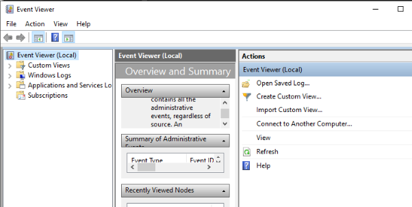

1. **Wevtutil**
- Công cụ dòng lệnh cho phép truy vấn, lưu log:

\``` 

wevtutil el                                     :: Liệt kê tất cả các log

wevtutil qe Security /c:5 /f:text     :: Hiển thị 5 dòng log mới nhất từ log bảo mật

\```

1. **PowerShell**

   ``` Get-EventLog -LogName System -Newest 20 ```

\


1. **TASK SCHEDULER – Lập Lịch Tự Động Trên Windows**
1. **Task Scheduler là gì?**

Task Scheduler (Bộ lập lịch tác vụ) là một công cụ có sẵn trong Windows, giúp tự động hóa các tác vụ theo lịch trình đặt trước. Công cụ này giúp bạn thực hiện các công việc như mở ứng dụng, chạy script, sao lưu dữ liệu, hoặc gửi thông báo mà không cần thao tác thủ công

1. **Các tính năng hữu ích của Task Scheduler**
1. **Bảo trì hệ thống**
- Task Scheduler là công cụ thực hiện nhiệm vụ chạy các chương trình diệt virus hoặc các công cụ bảo mật vào những thời điểm cụ thể để đảm bảo máy tính luôn an toàn.

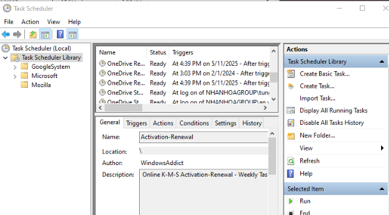

1. **Tự động hóa tác vụ**
- Cho phép lên lịch để tự động chạy các chương trình, script hoặc lệnh vào thời điểm cụ thể (ví dụ: mỗi ngày, mỗi tuần, khi đăng nhập, khi máy khởi động).
- Giúp tiết kiệm thời gian và tránh thao tác lặp lại thủ công
1. **Đa dạng điều kiện kích hoạt (Triggers)**
- Có thể cấu hình tác vụ khởi chạy theo nhiều  điều kiện:
  - Khi khởi động hệ thống.
  - Khi người dùng đăng nhập.
  - Khi máy không hoạt động (idle).
  - Theo lịch cụ thể (ngày, giờ).
  - Khi có sự kiện xuất hiện trong Event Viewer.
1. **Sao lưu và quản lý dữ liệu**

Task Scheduler cho phép người dùng tự động hóa quá trình sao lưu dữ liệu bằng cách lập lịch cho các tác vụ sao lưu theo thời gian định kỳ, chẳng hạn như hàng ngày, hàng tuần hoặc hàng tháng.

1. **Quản lý tập trung và ghi log**
- Tất cả các tác vụ được quản lý tập trung trong giao diện Task Scheduler
- ` `Có thể xem lịch sử hoạt động của tác vụ để xác định trạng thái thành công/ thất bại.
1. **Thực thi các tệp lệnh**
- Task Scheduler hỗ trợ tích hợp với PowerShell hoặc command line (schtasks.exe) để tạo, sửa, xóa hoặc chạy tác vụ, thuận tiện cho quản trị hệ thống và triển khai hàng loạt.
1. **Hướng dẫn cách sử dụng Task Scheduler** 
- Tham khảo link sau: <https://wiki.nhanhoa.com/kb/huong-dan-cach-tao-task-scheduler-tren-windows/> 
1. **Event Viewer (Trình xem sự kiện)**
1. **Khái niệm**  

**Event Viewer (Trình xem sự kiện)** là một công cụ tích hợp sẵn trong hệ điều hành **Windows**, cho phép người dùng và quản trị viên hệ thống **theo dõi, ghi nhận và phân tích các sự kiện xảy ra trong hệ thống**. Đây là một công cụ quan trọng trong việc **giám sát, chuẩn đoán sự cố và đảm bảo an ninh hệ thống**.

1. **Các loại log chính trong Event Viewer**
- **Application**: Ghi lại sự kiện từ các ứng dụng phần mềm cài đặt (như SQL Server, Office...), thông tin, lỗi và báo cáo cảnh báo về các hoạt động của chương trình

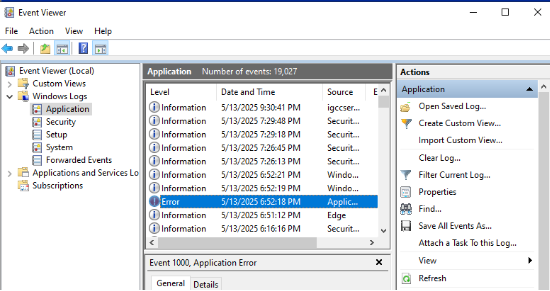

- **System**: Ghi lại sự kiện từ hệ điều hành và driver (như lỗi driver, khởi động/dừng dịch vụ)

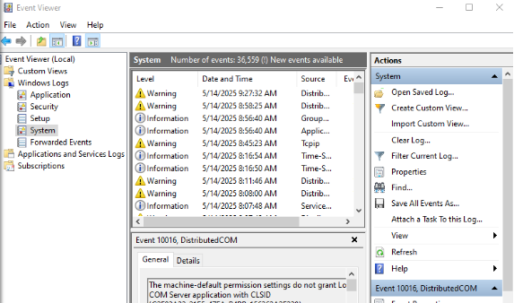

- **Security**: Ghi lại các sự kiện bảo mật: đăng nhập, đăng xuất, thất bại xác thực, chính sách bảo mật

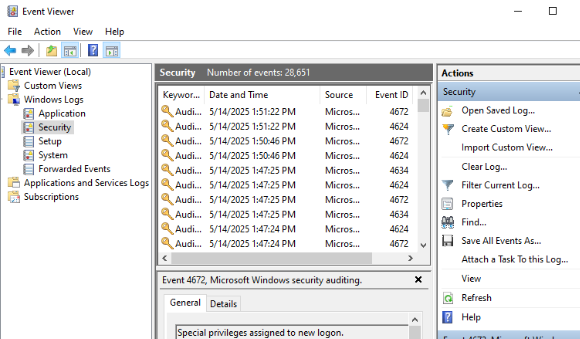

- **Setup**: Ghi lại các sự kiện liên quan đến quá trình cài đặt hệ thống

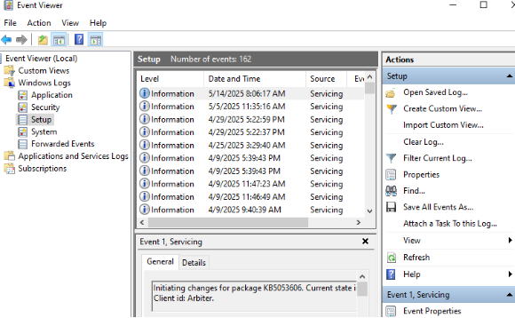

- **Forwarded Events**: Nhận log từ các máy khác nếu hệ thống có cấu hình Event Forwarding
1. **Các mức độ sự kiện (Event Level)**

|**Mức độ**|**Ý nghĩa**|
| :-: | :-: |
|**Information**|Thông tin chung, không có lỗi|
|**Warning**|Cảnh báo có thể dẫn đến lỗi trong tương lai|
|**Error**|Đã xảy ra lỗi gây ảnh hưởng tới hoạt động|
|**Critical**|Lỗi nghiêm trọng, hệ thống có thể bị dừng hoặc hỏng nghiêm trọng|
|**Audit Success / Failure**|(Trong log Security) Ghi nhận thành công/thất bại của sự kiện bảo mật|

1. **CÁC BIỆP PHÁP TĂNG CƯỜNG BẢO MẬT TRÊN WINDOWS**
1. **Bảo mật đăng nhập**
- **Sử dụng Mật khẩu Mạnh**: Sử dụng mật khẩu mạnh với độ dài tối thiểu 12 ký tự, bao gồm cả chữ hoa, chữ thường, số và ký tự đặc biệt.
  - Thay đổi mật khẩu thường xuyên (ít nhất mỗi 90 ngày) và không sử dụng cùng một mật khẩu cho nhiều tài khoản.
- **Cấu hình chính sách mật khẩu:** 
  - Account Lockout Policy: Khóa tài khoản sau nhiều lần đăng nhập sai.
  - Password Policy: Độ dài tối thiểu, độ phức tạp, thời gian hết hạn.
  - Interactive Logon Policy: Cấu hình hiển thị cảnh báo, yêu cầu xác thực cụ thể.
1. **Quản lý user và phân quyền**
- Tạo tài khoản người dùng với quyền hạn tối thiểu cần thiết để thực hiện công việc
- Tạo người dùng chuẩn (standard user), hạn chế dùng tài khoản admin
- **Gán user vào nhóm phù hợp** (Users, Administrators, Remote Desktop Users,...)

  ``` Control Panel  > Administrative Tools > Computer Management ```

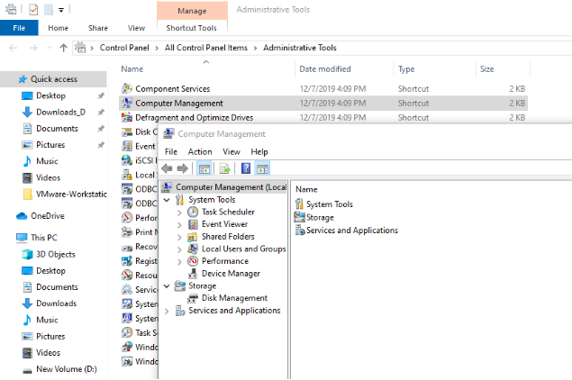

- Phân quyền cho file/folder
- Sử dụng Group Policy để quản lý user theo cấp hệ thống

1. **Cấu hình Tường lửa (Windows Firewall)**

Windows Firewall là tường lửa tích hợp sẵn của Windows, giúp kiểm soát lưu lượng mạng vào/ra hệ thống. Nó dựa trên luật (**rules**) để cho phép hoặc chặn các kết nối đến (**Inbound)**  hoặc đi (**Outbound)**

1. **Quản lý Firewall Rules -** Truy cập bằng: **wf.msc**

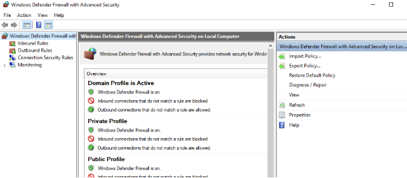

- Windows Firewall sử dụng **rules** (quy tắc) để kiểm soát lưu lượng **Inbound** và **Outbound** dựa trên:
  - Giao thức (TCP/UDP)
  - Port (cổng)
  - Tên chương trình hoặc dịch vụ
  - IP nguồn và IP đích
  - Profile mạng (Domain, Private, Public)
- Tắt giao thức **ICMP** ping địa chỉ **IP** 

  **```** New-NetFirewallRule -Name "Block\_ICMPv4\_In" -DisplayName "Block ICMPv4 Echo Request In" -Protocol ICMPv4 -IcmpType 8 -Direction Inbound -Action Block ```

- Chặn toàn bộ kết nối ra khỏi server trừ ứng dụng cho phép
- Mở port 3306 (MySQL), 3389 (RDP), 443 (HTTPS) theo yêu cầu dịch vụ
- **Ví dụ:** Mở port 80 (HTTP) cho web server chạy trên Windows:
- **Tạo Inbound Rule: → New Rule**

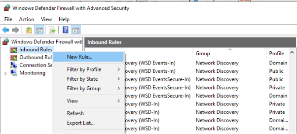

- Chọn **Port** → **Next**

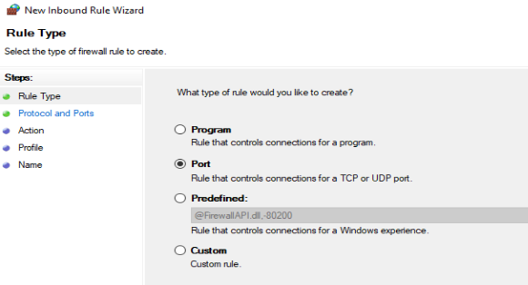

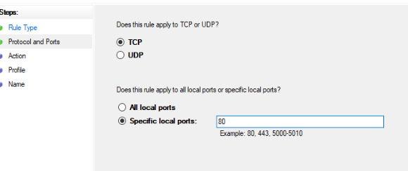

→**Next,  ,** \
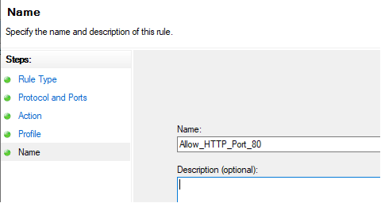

- Đặt tên:  Allow\_HTTP\_Port\_80 → **Finish**

  è Máy chủ Windows có thể nhận kết nối đến cổng 80 từ các client khác (dùng để phục vụ web).

- **Tạo Firewall Rule bằng PowerShell**
- **Mở port 443 (HTTPS):** 

``` New-NetFirewallRule -DisplayName "Allow\_HTTPS" -Direction Inbound -Protocol TCP -LocalPort 443 -Action Allow ```

- **Chặn app kết nối mạng (ví dụ: CMD.exe)**

  ``` New-NetFirewallRule -DisplayName "Block\_CMD\_Out" -Direction Outbound -Program "C:\Windows\System32\cmd.exe" -Action Block ```

- **Xóa một rule đã tạo:**

  ``` Remove-NetFirewallRule -DisplayName "Block\_CMD\_Out" ```


1. **Thường xuyên cập nhật (update) Windows**

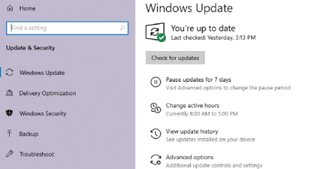

1. **Giám sát hệ thống:**
- Giám sát hệ thống Windows là quá trình theo dõi và ghi nhận các hoạt động diễn ra trên hệ điều hành nhằm:
  - Phát hiện bất thường, sai lệch, hoặc vi phạm bảo mật
  - Phân tích nguyên nhân sự cố (crash, lỗi dịch vụ, tấn công…)
  - Đảm bảo hệ thống vận hành ổn định, an toàn
  - Phục vụ công tác kiểm tra, kiểm toán (audit), điều tra số
- Sử dụng **Event Viewer** (eventvwr.msc) để theo dõi nhật ký sự kiện
- Security logs: Ghi nhận đăng nhập (ID 4624/4625), thay đổi tài khoản, audit policy
- System logs: Dịch vụ dừng/chạy, lỗi phần cứng, khởi động máy
- Application logs: Sự cố ứng dụng, đặc biệt là phần mềm bảo mật hoặc quản trị
- **Task Scheduler + Script:** giám sát định kỳ (taskschd.msc)
- Tạo tác vụ tự động kiểm tra log, dung lượng, gửi cảnh báo email
- Ví dụ: cảnh báo nếu có nhiều lần đăng nhập sai liên tiếp

``` Get-WinEvent -FilterHashtable @{LogName='Security';ID=4625} | Where-Object { $\_.TimeCreated -gt (Get-Date).AddMinutes(-10) } ```

1. **Phân Tích Logs Để Phát Hiện Tấn Công Trên Windows**
1. **Phân tích logs là gì?**
- Phân tích logs là quá trình **thu thập – lọc – kiểm tra – diễn giải** dữ liệu nhật ký (log) do hệ điều hành, ứng dụng và dịch vụ tạo ra, nhằm:
  - Xác định dấu hiệu bất thường
  - Phát hiện các hành vi đáng ngờ hoặc trái phép
  - Định danh các mối đe dọa như tấn công brute-force, malware, privilege escalation…
  - Truy vết sau sự cố (forensic investigation)
- Logs trên Windows có thể đến từ:
  - **Event Viewer**: Application, Security, System logs
  - **Firewall log**: Giao tiếp mạng bị chặn/cho phép
  - **Sysmon log**: Process, Registry, Network, File
  - **Windows Defender log**: Malware detection
  - **PowerShell log**: Command/script thực thi
1. **Các loại tấn công và ví dụ log cụ thể để phát hiện**

   Sử dụng **Event Viewer (eventvwr.msc**) là công cụ chính:

   1. **Brute-force đăng nhập (tấn công dò đoán mật khẩu)**
- **Dấu hiệu:** Nhiều log 4625 (Logon Failure) liên tiếp với cùng username
- **Cách kiểm tra**:
  - Event ID: 4625
  - Dựa vào các trường:
    - Account Name
    - Workstation Name
    - Failure Reason

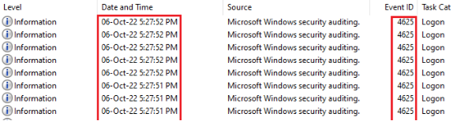

- VD: ```

An account failed to log on.

Failure Reason: Unknown user name or bad password.

Account Name: administrator

Workstation Name: DESKTOP-HACKER

Logon Type: 3 (Network)

\```

1. **Tấn công leo thang đặc quyền (Privilege Escalation)**
- **Dấu hiệu**: Tài khoản bình thường xuất hiện **log 4672** (special privileges).
- **Cách kiểm tra**:
  - Event ID: 4672
  - Kiểm tra:
    - Account Name
    - Privileges: nếu có SeDebugPrivilege, SeTcbPrivilege,...
- **Ví dụ log**: ```

Special privileges assigned to new logon.

Account Name: john\_user

Privileges: SeDebugPrivilege, SeImpersonatePrivilege

\```

1. **Tấn công thực thi lệnh từ xa (Remote Code Execution)**
- Hacker thực thi script độc hại thông qua PowerShell, WMI, cmd, net.exe,..
- Dấu hiệu Log cần theo dõi:
  - **Event ID:  4688** (New Process Created)

\``` 

A new process has been created.

New Process Name: C:\Windows\System32\WindowsPowerShell\v1.0\**powershell.exe**

Command Line: powershell -enc JABwAD0AXAB...

\```

1. **Persistence – Duy trì truy cập sau xâm nhập**
- Dấu hiệu: **Event ID 4697** (Security) hoặc 7045 (System) báo dịch vụ mớ

  ``` 

A service was installed in the system.

Service Name: backdoorService

Service File Name: C:\Users\Public\**svc.exe**

`		````
