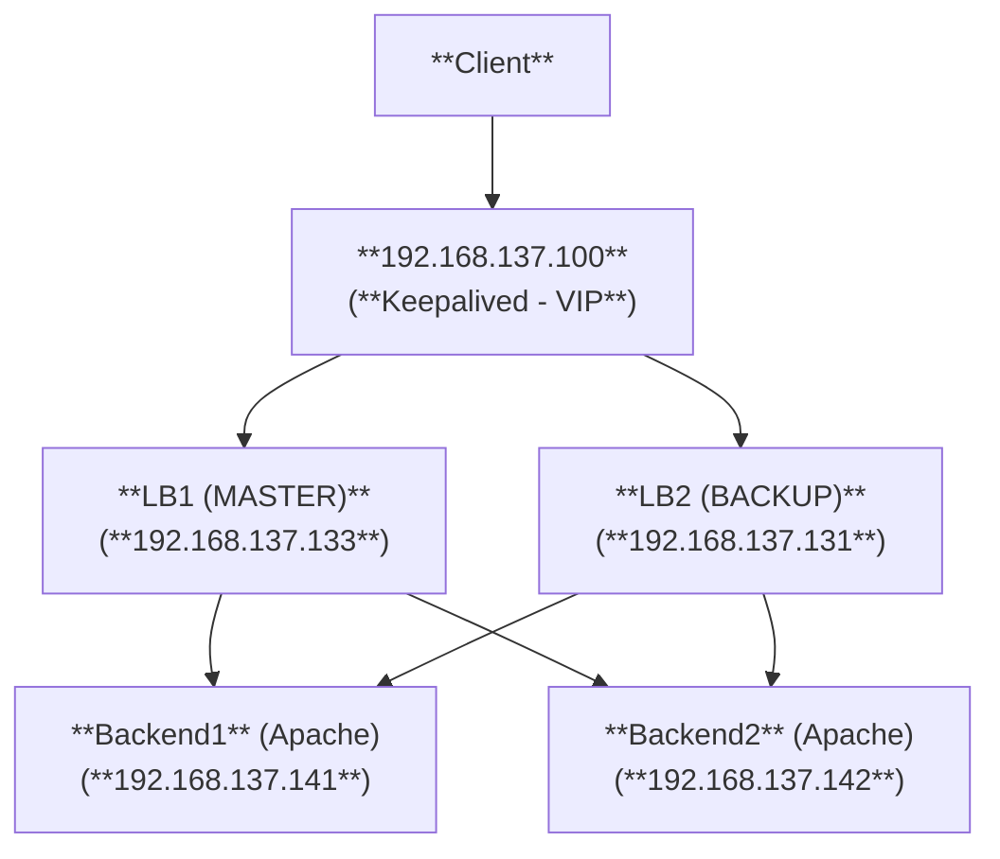

# KEEP-ALIVED (VIP Failover) 

> **Mô Hình hệ thống**
> - **2 Backend** Apache Web Server 
>-  **1 Nginx Reverse Proxy** kiêm **Load Balancer** (đã có) - **LB1** 
>-  **1 Keepalived** trên Load Balancer để tạo Virtual IP (VIP), giúp hệ thống sẵn sàng failover
>- **1 BACKUP** (Nginx + Keepalived)- **LB2**




## 1. Cài đặt Keepalived trên Nginx Load Balancer

```bash!
sudo apt update
sudo apt install keepalived -y
```
## 2. Cấu hình Keepalived cho VIP

- File cấu hình: `/etc/keepalived/keepalived.conf`
- Chỉnh sửa: 
```bash!
global_defs {
   router_id NGINX_MASTER
}

vrrp_instance VI_1 {
    state MASTER
    interface ens33   # <--tên card mạng của máy, Kiểm tra: ip a
    virtual_router_id 51
    priority 100
    advert_int 1
    authentication {
        auth_type PASS
        auth_pass 123456
    }
    virtual_ipaddress {
        192.168.137.100
    }
}


```

- **Khởi động và kiểm tra**
```
sudo systemctl enable keepalived
sudo systemctl start keepalived
```
- **Kiểm tra IP ảo:**
```
ip a | grep 192.168.100.100
```

--> Output **OK:** 


## 3. Cài đặt trên LB2 
- **Cài Nginx và Keepalived:**
```bash!
sudo apt install nginx keepalived -y
```
- **Cấu hình chia tải như trên LB1**
```bash!
#sudo vi /etc/nginx/nginx.conf

http {
    upstream apache_backend {
        server 192.168.137.141;
        server 192.168.137.142;
    }

    server {
        listen 80;

        location / {
            proxy_pass http://apache_backend;
            proxy_set_header Host $host;
            proxy_set_header X-Real-IP $remote_addr;
        }
    }
}
```

- **Tạo file cấu hình Keepalived trên LB2**:
```bash!
#sudo nano /etc/keepalived/keepalived.conf

global_defs {
    router_id NGINX_BACKUP
}

vrrp_instance VI_1 {
    state BACKUP
    interface ens33         # <--tên card mạng của máy LB2
    virtual_router_id 51
    priority 90             # <-- thấp hơn MASTER
    advert_int 1

    authentication {
        auth_type PASS
        auth_pass 123456
    }

    virtual_ipaddress {
        192.168.137.100
    }
}
```

- **Khởi động dịch vụ:**
```bash!
sudo systemctl enable keepalived
sudo systemctl start keepalived
```

## Test failover

- **Kiểm tra trạng thái VIP đang ở LB1:**
```
ip a | grep 192.168.137.100
```


- **Giả sử LB1 gặp sự cố:**
```bash!
#Tắt dịch vụ Keepalived
sudo systemctl stop keepalived

# Hoặc ngắt card mạng interface (mô phỏng mất kết nối)
sudo ip link set ens33 down

#hoặc giả lập server bị treo, sập nguồn:
sudo halt 
sudo reboot
```

- **Kiểm tra trạng thái VIP đang ở LB2**
```bash!
ip a | grep 192.168.137.100
```


--> VIP đã chuyển qua LB2 → **Failover thành công!**

- **Truy cập từ client:**


